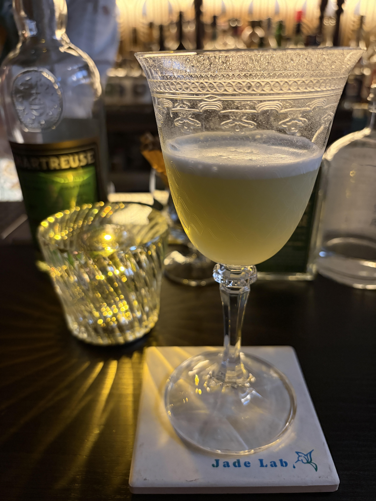

#### Beuser & Angus Special

---

Jade Labの藤井さんにいただいた香り高いラストワードのようなカクテルです． 

<li>
50ml. green chartreuse
</li>
<li>
10ml. maraschino
</li>
<li>
15ml. lime juice
</li>
<li>
½ tsp. powdered sugar
</li>
<li>
½. egg white
</li>
<li>
½ tsp. orange flower water
</li>

Beuser & Angus SpecialはBerlinのVictoria barでうまれたカクテルでラストワードとラモスジンフィズに影響を受けたカクテルです．

---

参考文献 
[Povilasのホームページ](https://www.grouchy-bartender.com/cocktails/beuser-angus-special)

**[一覧に戻る](/alcohol)**