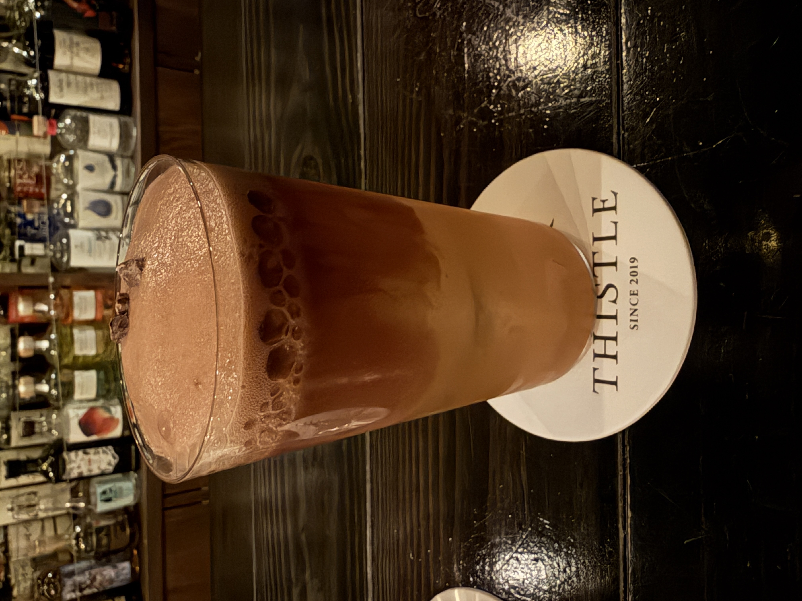

#### Cacao Fizz

---

Bar Thistleで吉田さんにつくっていただいたカクテルです．
<li>
gin
</li>
<li>
cacao
</li>
<li>
bergamot
</li>
<li>
vinegar
</li>
<li>
soda
</li>

カカオの深い香りで口当たりもよくとても美味しかったです． 
カカオのビターさとヴィネガーの酸味がとても相性が良く面白いカクテルです．

---

**[一覧に戻る](/alcohol)**