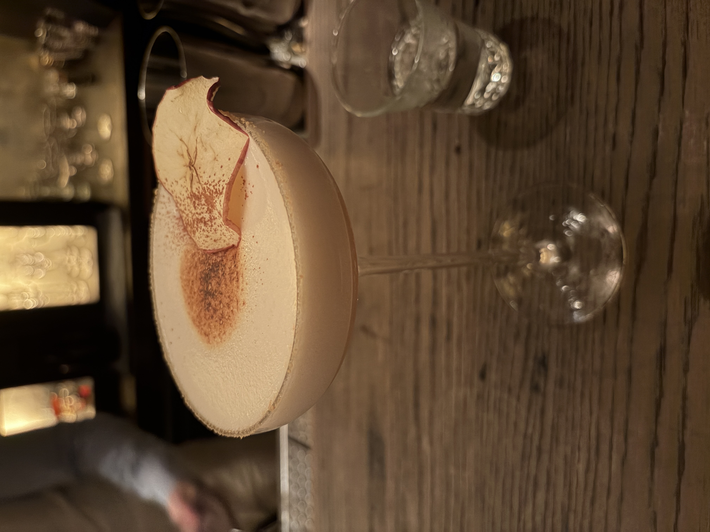

#### Drunken Grandma's Apple Pie

---

The SG Clubのsipでいただいた素晴らしいデザートカクテルです．

<li>
baked apple
</li>
<li>
browned butter
</li>
<li>
egg white
</li>
<li>
white miso
</li>

一見白味噌との相性が想像できなかったでのすが素晴らしく美味しくて驚きました．

---

**[一覧に戻る](/alcohol)**