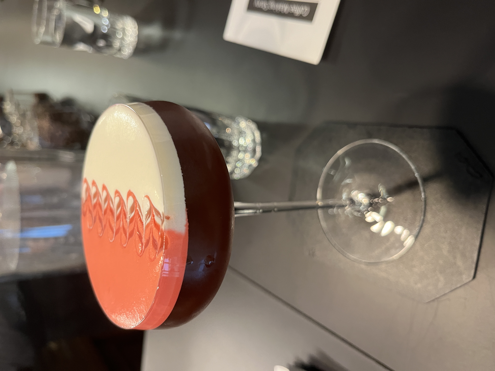

#### Element

---

ISTA COFFEE ELEMENTSのシグネチャーカクテルでまるでケーキのようでとても美味しいデザートカクテルです． 

<li>
coffee
</li>
<li>
brandy
</li>
<li>
rose
</li>
<li>
raspberry
</li>
<li>
cream
</li>
<li>
campari
</li>

Bar Thistleの5周年イベントで初めて野里さんのこのカクテルを飲んで，コーヒーもカクテルも素晴らしかったのでお店にもよく行くようになりました．

---

**[一覧に戻る](/alcohol)**