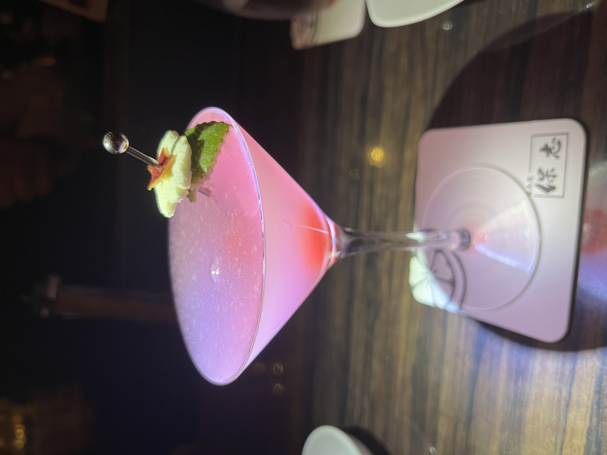

#### Falling Star

---

さくらさくらは保志さんの全国バーテンダー技能競技大会の優勝カクテルです．
<li>
white rum
</li>
<li>
pineapple liqueur
</li>
<li>
blue curaçao
</li>
<li>
fresh lemon juice
</li>
<li>
fresh grapefruit juice
</li>

Bar 保志 本店で川上さんにつくっていただき名古屋の話で盛り上がったのは良い思い出です．

参考文献 
[保志さんのオリジナルカクテル一覧](https://8star.family/drink/)

---

**[一覧に戻る](/alcohol)**