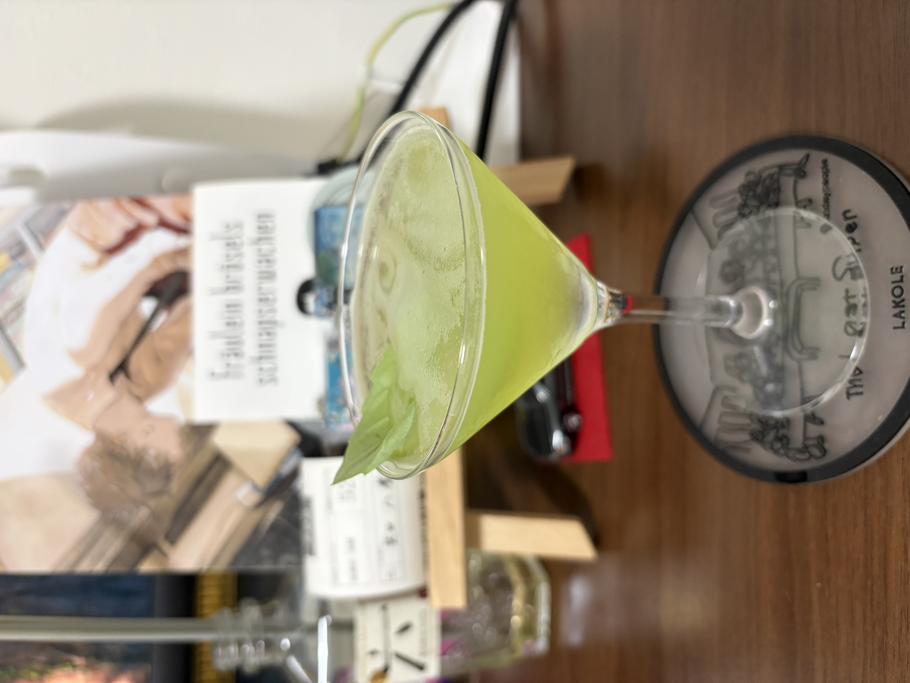

#### Fresh Herb Gimlet

---

ハーブが好きなので鹿山さんの動画をみてつくってみました．
<li>
1 ½ oz. gin
</li>
<li>
some fresh herb
</li>
<li>
½ oz. freshly pressed lime juice
</li>
<li>
1 tsp. syrup
</li>

簡単に作ることができ，香りも味わいもとても良いのでお気に入りのカクテルです． 
ハーブの美しい色で香りもよく最高です．

参考文献 
[鹿山さんの動画](https://youtu.be/duJq18UTMlE?si=1uhQxNNMS5kHswCv)

---

**[一覧に戻る](/alcohol)**