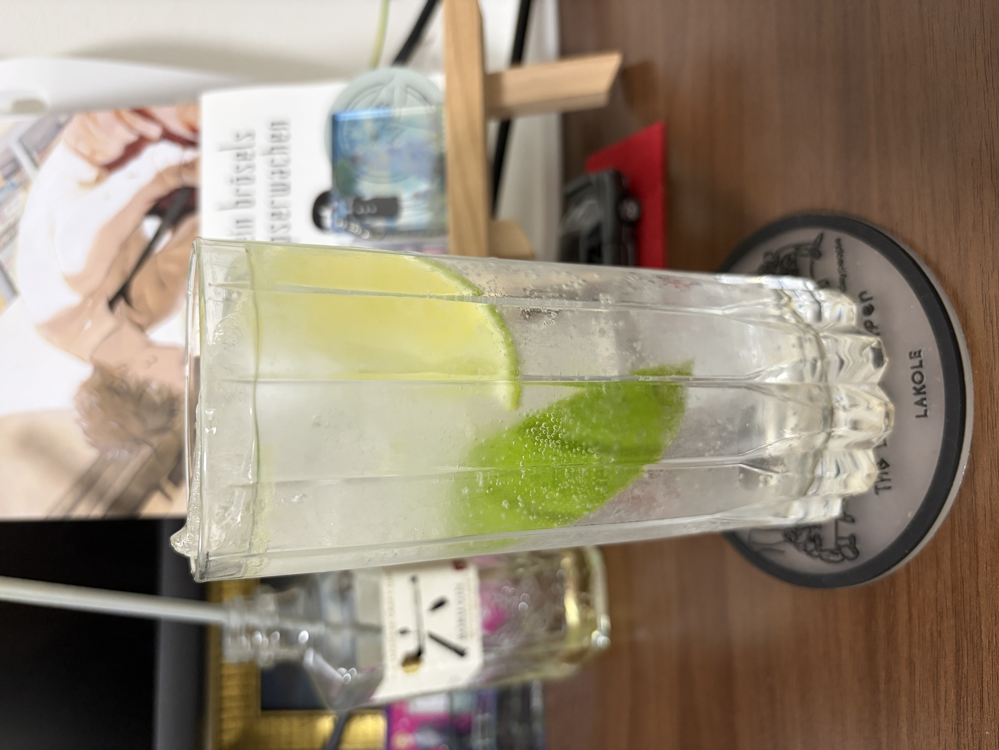
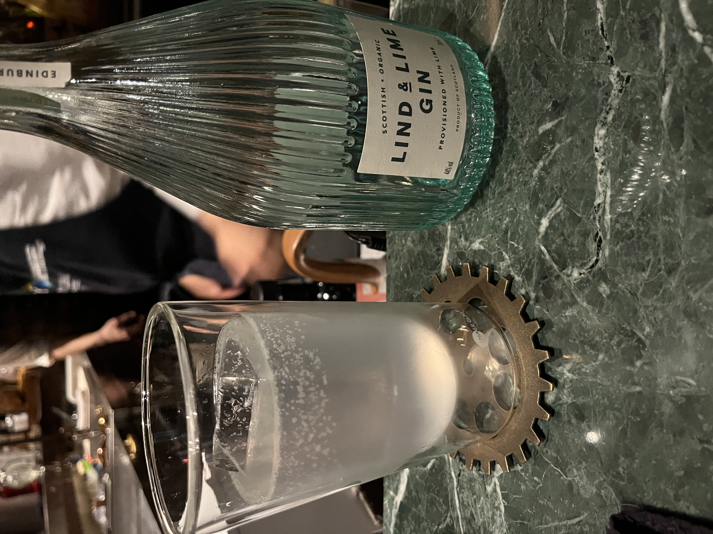
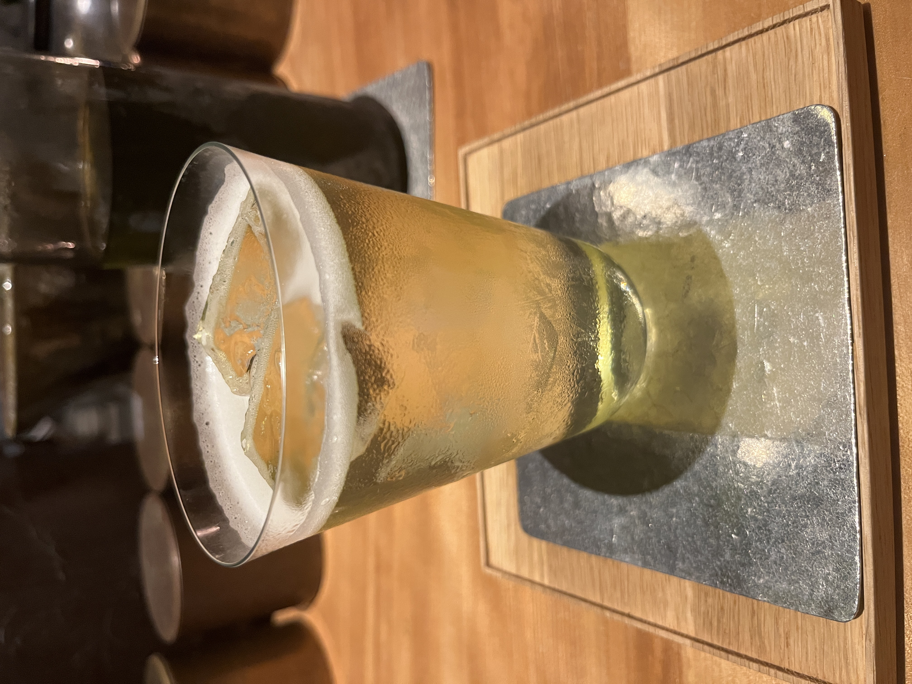
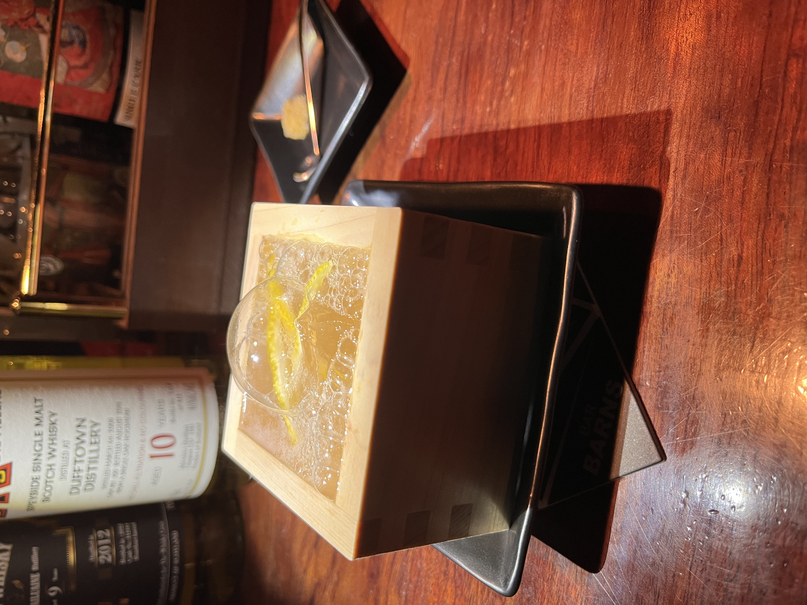
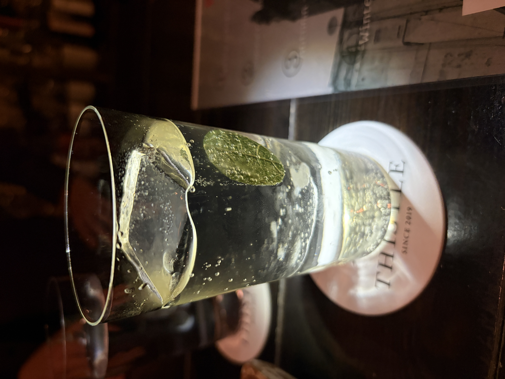
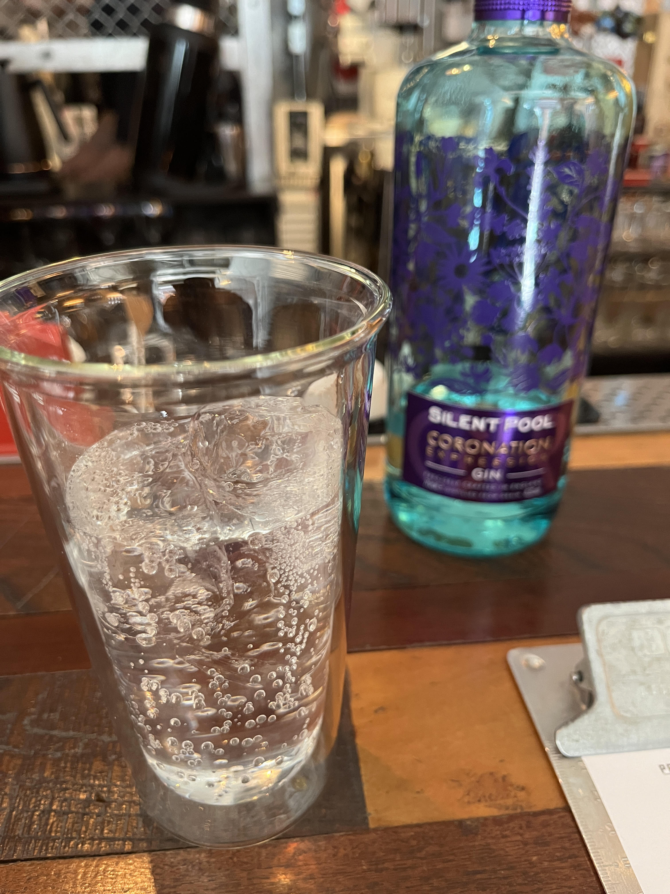
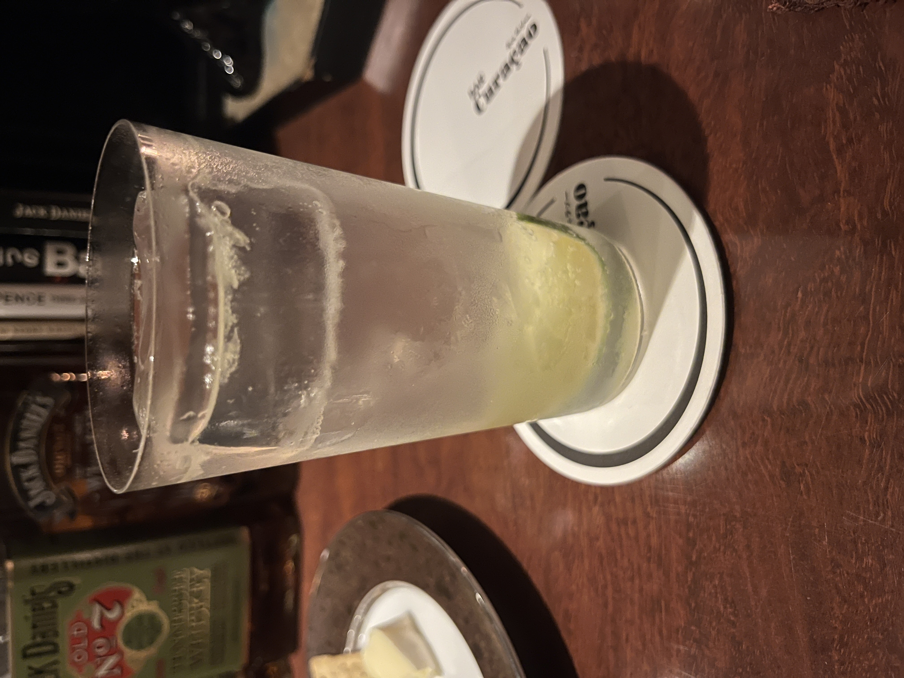
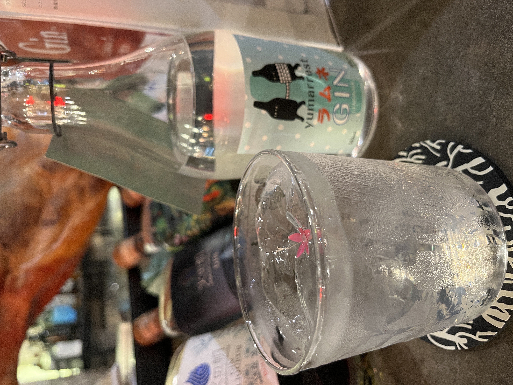
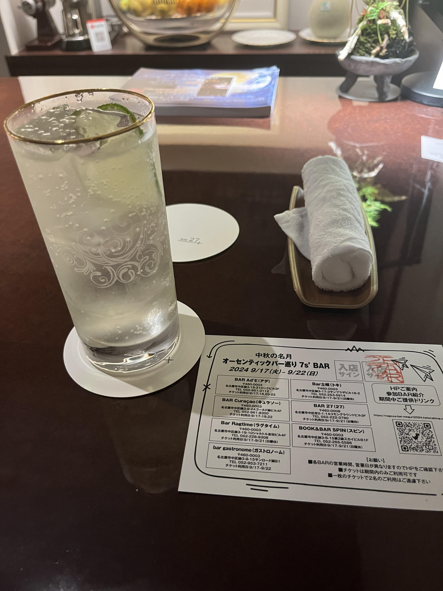
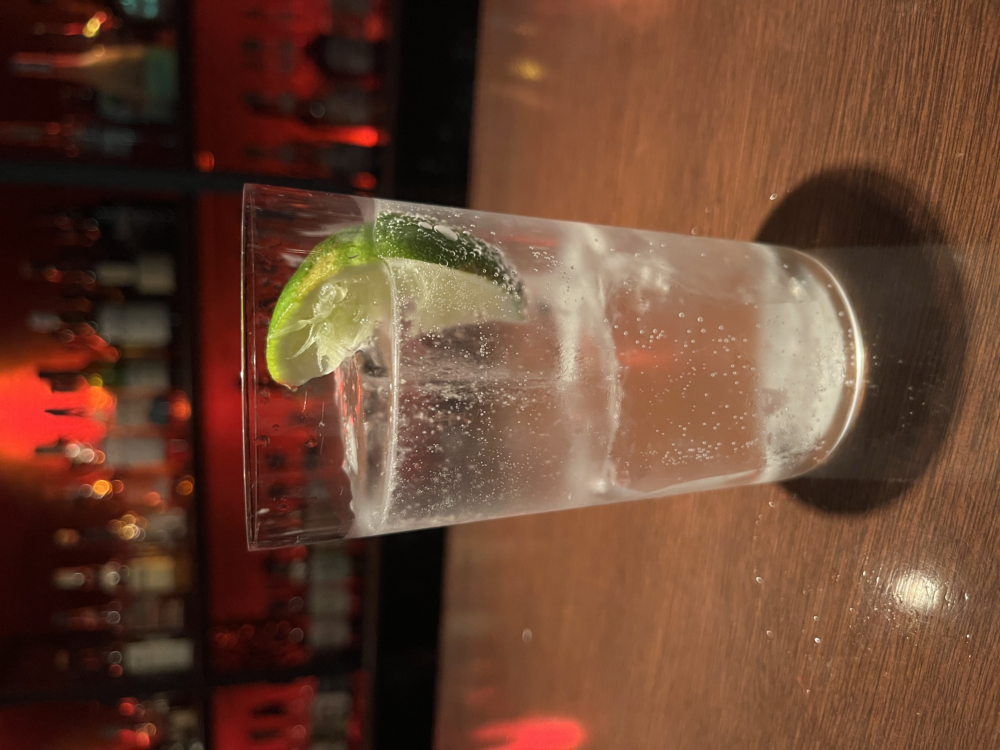

#### Gintonic

---

Bar Juniperさんでたくさんジンのお話を聞きながらジントニックを飲んだのは良い思い出です．
<li>
1 ½ oz. gin
</li>
<li>
1 tsp. freshly pressed lime juice
</li>
<li>
full up. tonic woter
</li>

ジントニックは1800年代にイギリスの植民地であったインドで流行っていたマラリアにトニックウォーターのキニーネが有用であることがわかり，薬用酒として飲み始めたのが起源のようです．

---

Bar Juniperでは3人で20杯ほどジントニックを飲み比べる会をさせていただき，同じジントニックでも全然違いとても面白かったです． 
特にLind & Line Ginがとても美味しかったです．(気に入って自分でも購入しました笑)

Mixology Salonでは煎茶ジントニックをいただきました． 
煎茶の良さを最大限に活かしておりとても美味しいです． 
何度行っても一杯目はこれが安定かなと思います．

Bar Barnsでは枡のジントニックをいただきました． 
柑橘系のすっきりとした感じと檜のとても良い香りで絶品でした．

Bar ThistleでBar ChamのByungjin Limさんのゲストシフトでは秋を感じるジントニックをいただきました． 
スパイスが効いていて，無花果の葉からとても良い余韻がうまれており最高に美味しかったです．

Liquid factoryではSilent Poolの珍しいver.のジントニックをいただきました． 
ここはシェイクなども美味しいですが柑橘が効いたジントニックは格別でした．

House of KI NO BIでは抹茶のジントニックをいただきました． 
深い抹茶との相性は抜群で美味しいです． 
2階ではジンに関することを色々と知ることができてとても面白かったです．

Bar Curaçaoはクラシックカクテルのレベルがどれも高く，他との違いがわかります．

The Roots of all evil.はジンの揃えが良く，好きなものでカクテルを作ってもらえるので発売されて間もなかったyumarrestのラムネジンでジントニックを作ってもらいました． 
すっきりとしていてとても美味しかったです．

Bar27では中秋の名月のイベントでジントニックをいただきました． 
少しウイスキーをフロートさせることで味に複雑さを出していてとても美味しかったです．

dosではシンプルで柑橘系の効いたジントニックをいただきました．

参考文献 
[AREA STYLE MAGAZINE](https://asm.asahi.com/article/13407372)

---

**[一覧に戻る](/alcohol)**