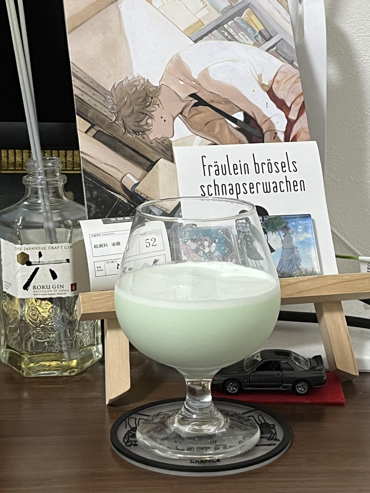
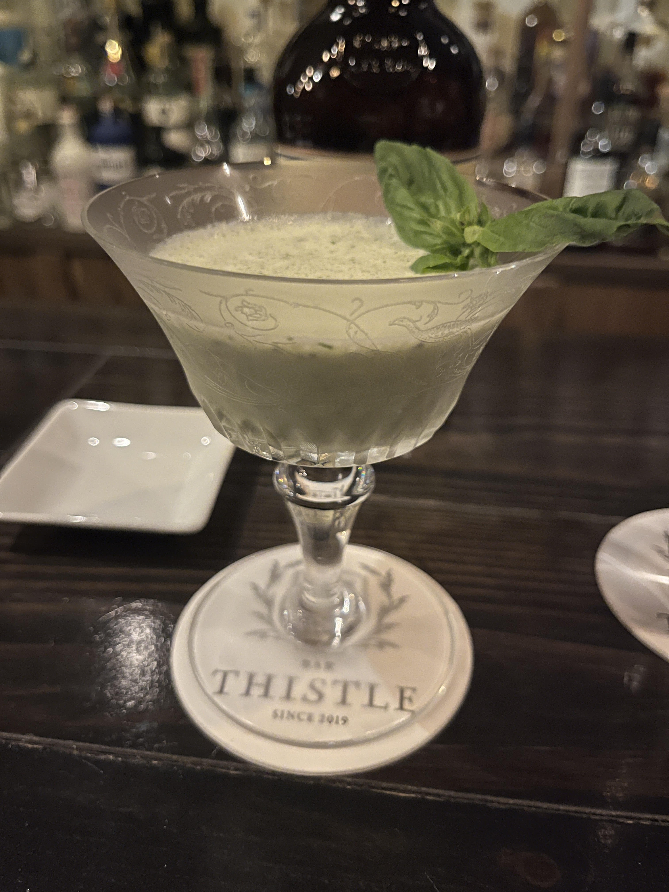
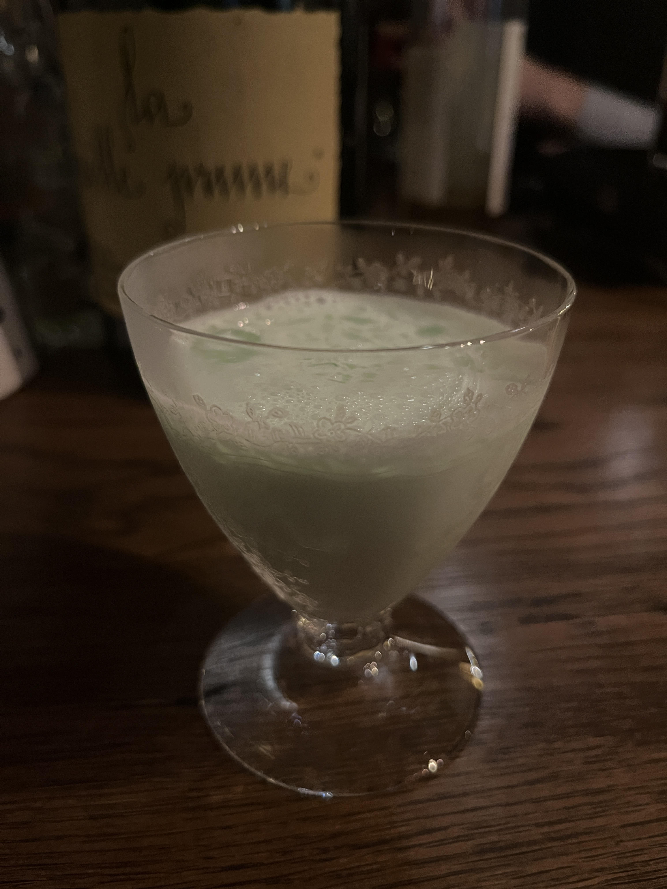
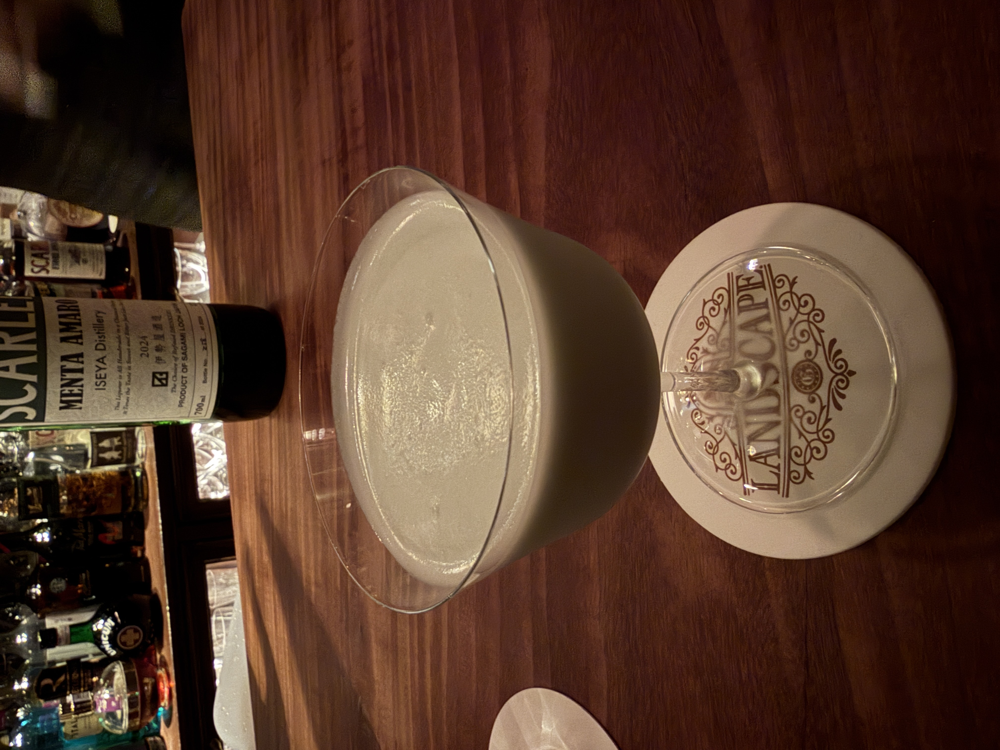
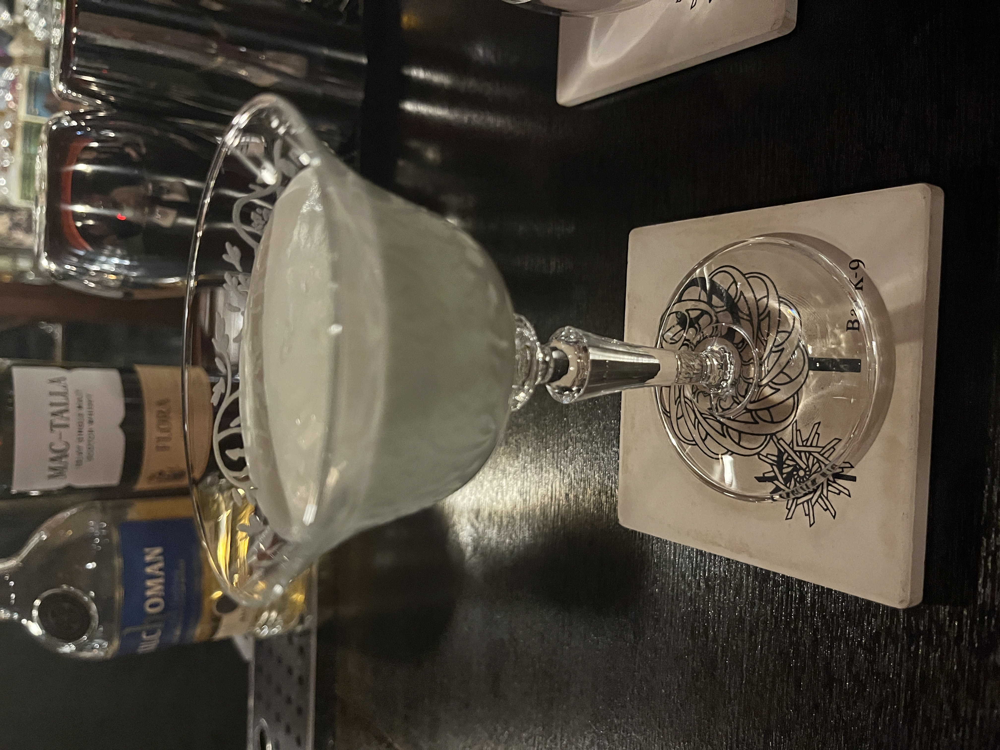
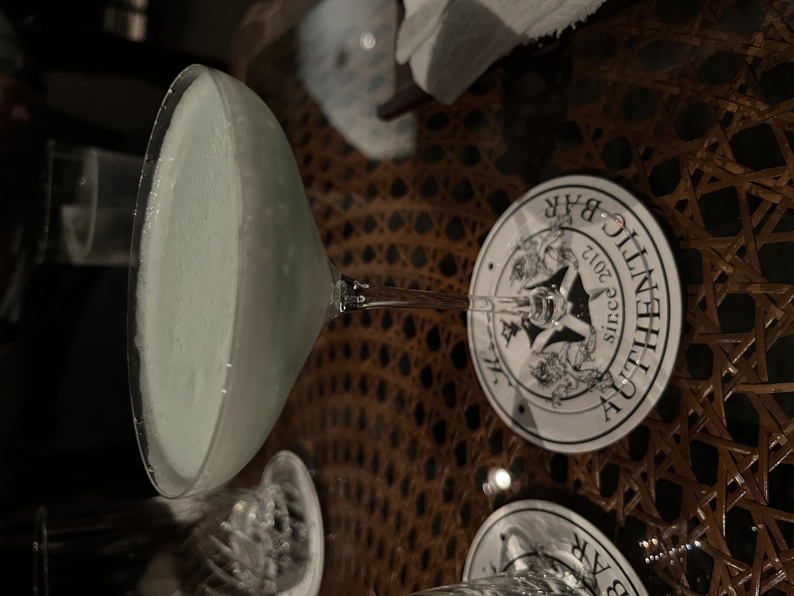
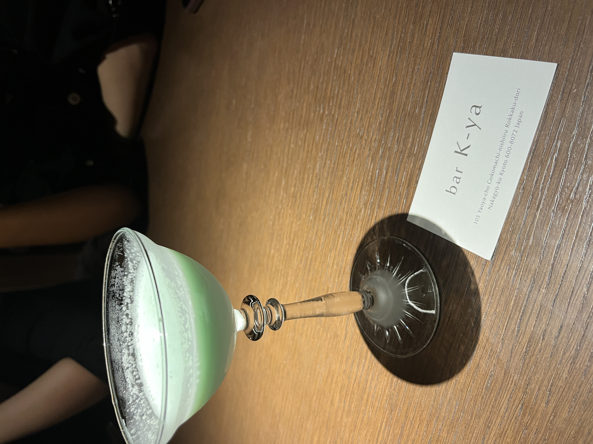

#### Grasshopper

---

Grasshopper発祥の地 
【Tujague's Restaurantのgrasshopperレシピ】
<li>
¾ oz. green créme de menthe
</li>
<li>
¾ oz. white Crème de Cacao
</li>
<li>
¾ oz. dark créme de cacao
</li>
<li>
¾ oz. white créme de menthe
</li>
<li>
½ oz. brandy
</li>
<li>
¾ oz. heavy cream
</li>
<li>
¾ oz. whole milk
</li>
<li>
½ tsp. Brandy for topper
</li>

グラスホッパーは1918年にアメリカ合衆国ルイジアナ州ニューオリンズにあるTujague's Restaurantでうまれたようです． 
当時はプース・カフェ・スタイルで楽しまれていたようです．

---

私がバーに行き始めて間もない頃にBar Thistleで吉田さんのバジルグラスホッパーを飲んでその美味しさに驚き，好きになったチョコミントの生みの親のデザートカクテルです．

Bar B&Fで伊藤さんとグラスホッパーについて色々話して作っていただいたのも良い思い出です．(2025年末からはBar Amberにいらっしゃいます．) 
伊藤さんはシェイクをあえて荒くして氷を越さずに残し，アブサンを加えるのが良いとおっしゃっていました． 
実際に飲むとアブサンで深さが増し，素晴らしかったです．

Bar Landscape.では伊勢屋酒造のメンタアマーロを使ってもらって爽快感があり，クリーミーでとても美味しかったです． 
氷は大きいものを1つ入れ，シェイクし，さらに氷を濾して注いでくださったので口当たりが素晴らしく良く，なめらかでとても美味しかったです．

Bar K9の後藤さんのグラスホッパーは生クリームをクリーマーで泡立てることで滑らかさが口当たりをとても良くしていて絶品です．

Bar Kreisのグラスホッパーは生クリームが多過ぎず，繊細なミントの香りをよく感じられて美味しかったです．

Bar K家のグラスホッパーは色鮮やかですっきりと飲めて美味しかったです．

---

参考文献 
[鹿山さんのブログ](https://ameblo.jp/kayama0927/entry-12592278144.html)

**[一覧に戻る](/alcohol)**