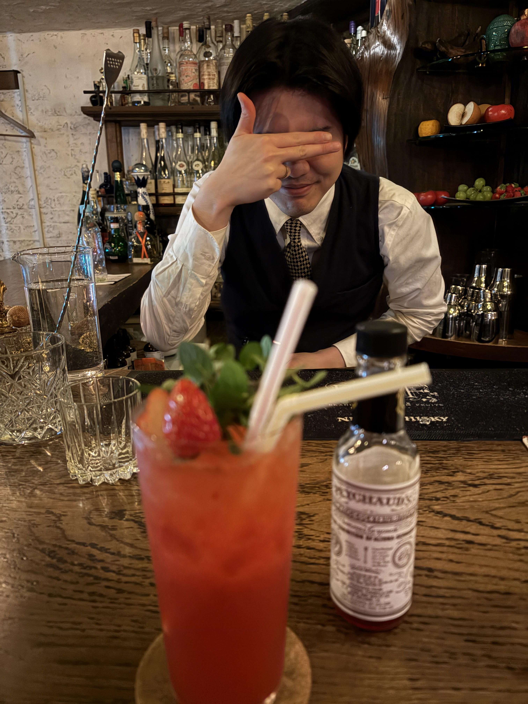

#### Gunshop Fizz

---

Bar B&Fで伊藤さんにつくっていただいたカクテルです． 
このカクテルはペイショーズビターズをベースに使う面白いカクテルです． 
B&Fならではの苺のフレッシュさを活かして伊藤さんならではのビターズの使い方に笑える素晴らしいカクテルでした．

<li>
60ml. Peychoud's Bitters
</li>
<li>
30ml. fresh lemon juice
</li>
<li>
30ml. simple syrup
</li>
<li>
2. strawberries
</li>
<li>
3 slice. cucumber
</li>
<li>
3. grapefruit peel
</li>
<li>
3. orange peel
</li>

このカクテルは2009年にNew Orleans州のCureのKirk Estopinal氏とMaksym Pazuniak氏によってつくられました．

---

**[一覧に戻る](/alcohol)**