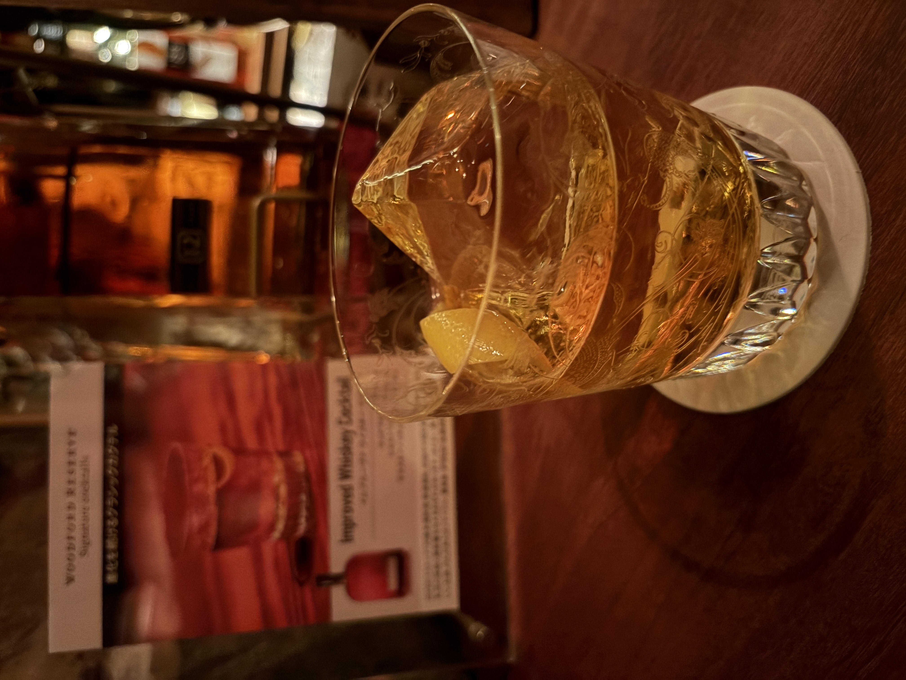

#### Improved Whiskey Cocktail

---

Bar Landscape.で松尾さんにつくっていただきました．
<li>
1 ½ oz. woodford reserve
</li>
<li>
½ oz. chartreuse jaune
</li>
<li>
1 tsp. maraschino liqueur
</li>
<li>
2 dashes. absinthe
</li>
<li>
1 piece. lemon peel
</li>

初めはレモンの酸味が効いた香りが広がり，ゆっくりと口に含むとウイスキーやマラスキーノの甘さとシャルトリューズとアブサンの爽やかさが絶妙に相性が良く，深い美味しさが楽しめました． 
松尾さんに頼む時にロックかストレートか選ばせていただけたので今回はロックでいただきました．
ロックではゆったりと飲むことで氷が溶けながら味わいがまろやかになっていくのがまた良いのかなと思いました．

参考文献 
[松尾さんの動画](https://youtu.be/rG8I-x8SHuw?si=gfa3XAaRWsT7l3nb)

---

**[一覧に戻る](/alcohol)**