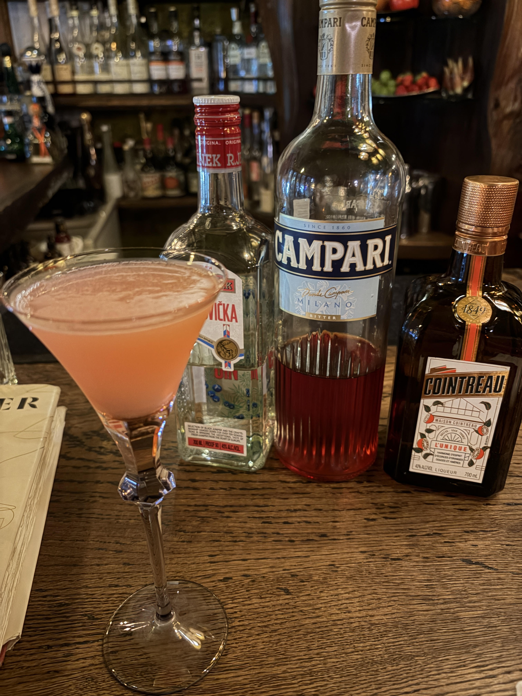

#### Jasmine

---

Bar B&Fで伊藤さんにつくっていただいたカクテルです． 
このカクテルはグレープフルーツを一切使用しないのにまるでフレッシュなグレープフルーツを思わせる不思議なカクテルです． 
<li>
35ml. gin
</li>
<li>
15ml. fresh lemon juice
</li>
<li>
5ml. cointreau
</li>
<li>
5ml. campari
</li>

このカクテルは1990年にCalifornia州のTownhouseのPaul Harrington氏によってつくられました． 
Paul Harrington氏は友人のMatt Jasmin氏に今までつくったことのないものを何かつくってくれと頼まれたことがきっかけで生まれたカクテルです． 
名前の由来は上記のJasmin氏なのですが，Paul Harrington氏は友人の綴りにeがないことに数年後に気付きました．
しかし，その時にはもうすでにJasmineという名前で世界中に広まっていてそのままJasmineというカクテルが有名になったようです．

---

**[一覧に戻る](/alcohol)**