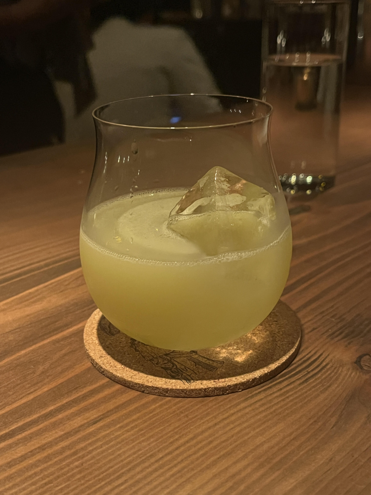
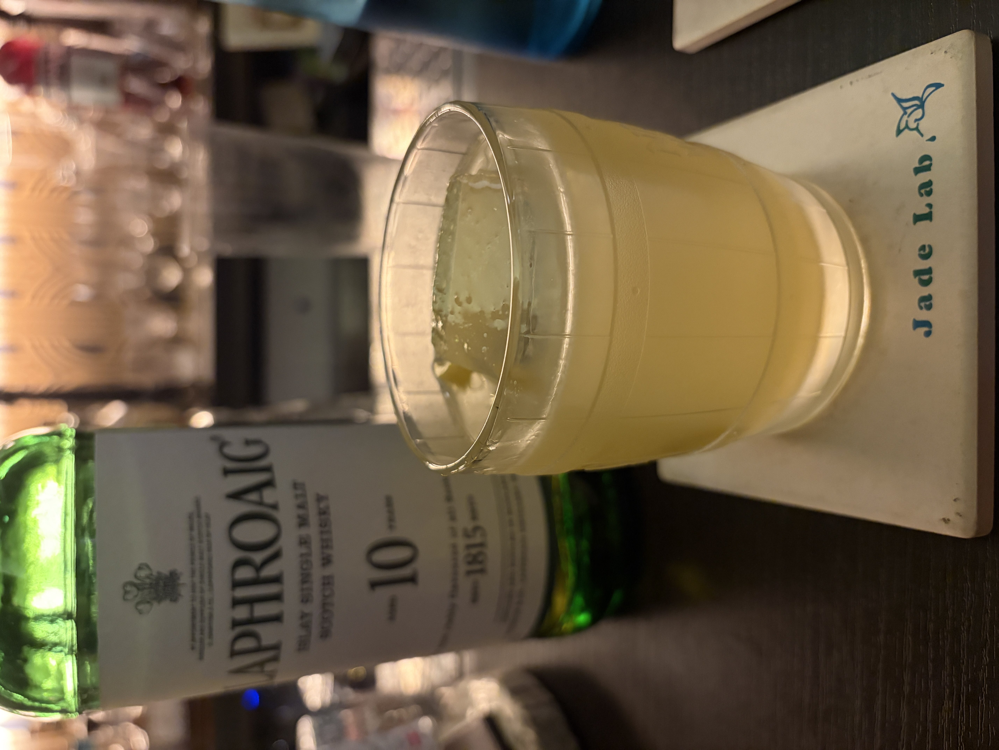

#### Laphroaig Project

---

Bar BenFiddichの別館で伊藤さんにつくっていただいたカクテルです． 
最初で最後の伊藤さんの別館Dayで大盛況の中つくっていただきました．
<li>
30ml. green chartreuse
</li>
<li>
30ml. fresh lemon juice
</li>
<li>
15ml. laphroaig quarter cask scotch
</li>
<li>
15ml. maraschino liqueur
</li>
<li>
15ml. yellow chartreuse
</li>
<li>
2dsh. fee brothers peach bitters
</li>
<li>
1. lemon peel
</li>

このカクテルは2009年にSan Francisco州のBourbon&BranchのOwen Westman氏によってつくられました． 
Owen Westman氏はオーストラリア出身のバーテンダーさんでBourbon&Branchで修行するために渡米し，その滞在中につくられたようです．

Jade Labの藤井さんにはラフロイグのクウォーターカスクがなかったので別のものでうまく作っていただきましたがとても美味しかったです．

---

**[一覧に戻る](/alcohol)**