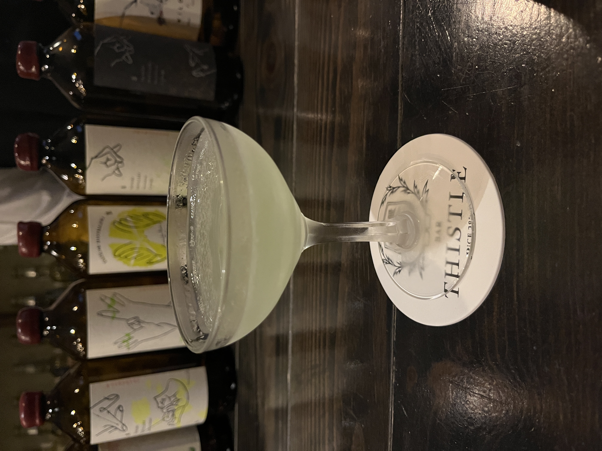
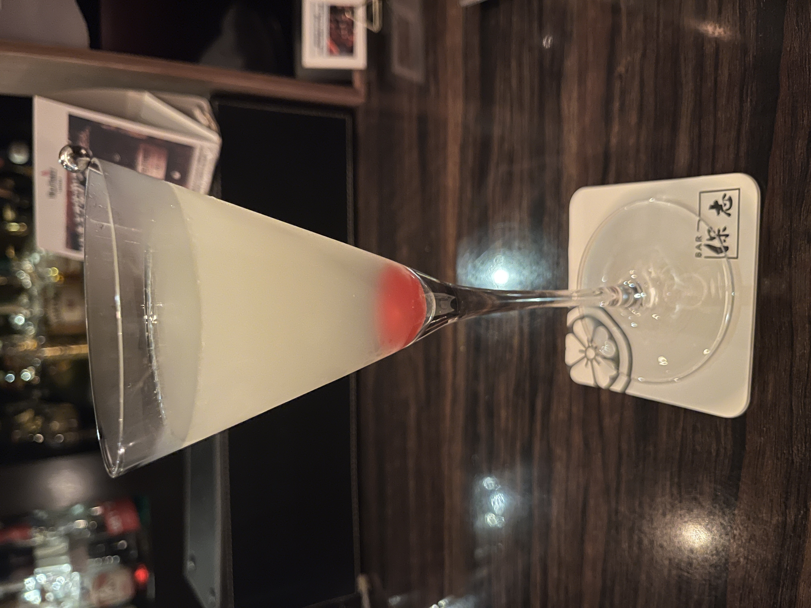

#### Last Word

---

Bar Thistleさんで2025年→2026年の年越しパーティでシェイクさせていただいた思い出の一杯です！
<li>
½ oz. gin
</li>
<li>
½ oz. green Chartreuse
</li>
<li>
½ oz. maraschino liqueur
</li>
<li>
½ oz. freshly pressed lime juice
</li>

ラストワードは1910年代にアメリカ合衆国ミシガン州にある Detroit Athletic Clubでうまれたようです． 
当時のアメリカ合衆国は禁酒法時代真っ只中だったため，考案者の名前は伏せられているようです．

---

バー保志の川上さんのラストワードはジンの割合が少し多めでガーニッシュにチェリーを添えており，バランスよくとても美味しかったです． 
川上さんとは東京であったのですが，元々Bar Kreisで働かれていたようで愛知の話で盛り上がっていたのも懐かしい思い出です．

---

**[一覧に戻る](/alcohol)**