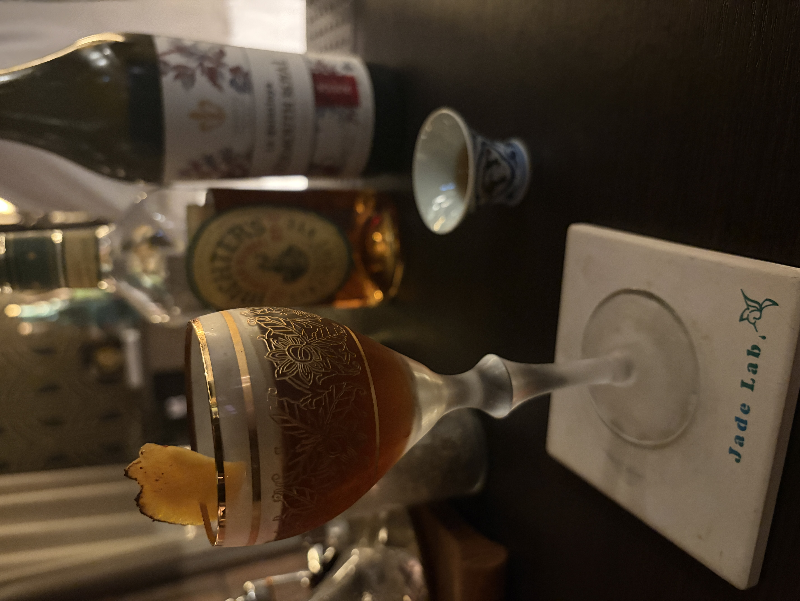

#### Manhattan

---

Jade Labで藤井さんに作っていただいた最高のカクテルです． 
「カクテルの女王」の異名をもつマンハッタン 
考案者が誰かは分かっておらず，誕生の由来にも諸説あるようです． 
1870年代半ばから1884年までの間にニューヨークの社交クラブ「マンハッタン・クラブ」で考案され，マンハッタン島もしくはそのクラブ名にちなみ「マンハッタン」と名付けられたようです． 
<li>
45ml. rye whisky
</li>
<li>
15ml. sweet red vermouth
</li>
<li>
1dsh. angostura bitters
</li>

マンハッタンはさつまいも味があるという説明をきいてまさに確信を築いていて面白いなと思いました． 
そのため，炙ったマンゴーとの相性は抜群で大阪の某N山Kさんがベタ褒めするのも納得でした笑 
西山さんが後藤さん不在のBar K9でカクテルを振る舞う日に自分のものより藤井さんのマンハッタンを飲んで欲しいと言われた時は本当に笑いましたが飲んで納得でした笑

Bar Reservaの吉田さんには穀物味たっぷりのマンハッタンをつくっていただきました． 
濃厚なチェリーに相性抜群でとても美味しかったです．

---

[藤井さんのマンハッタンの地名の解説](https://jade-lab.com/column/b1dc7275-dbe1-413c-b086-bc07bf6c2699)

**[一覧に戻る](/alcohol)**