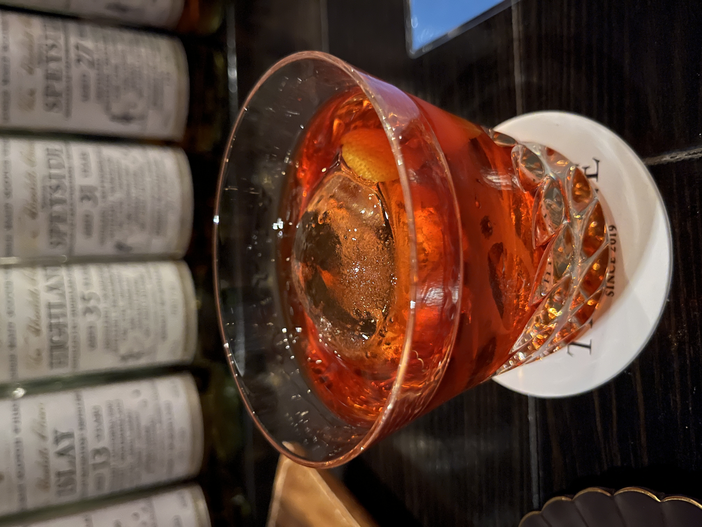
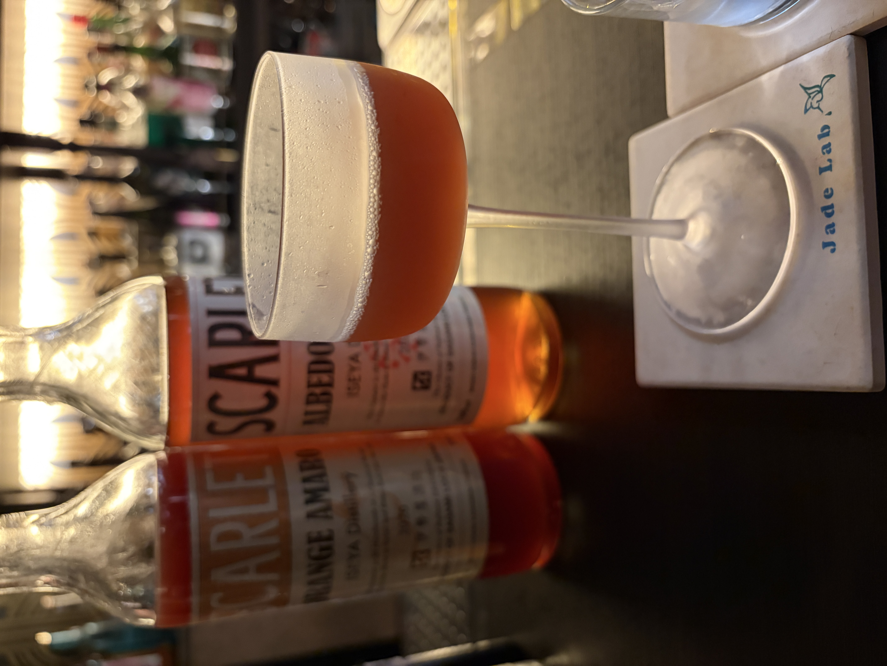
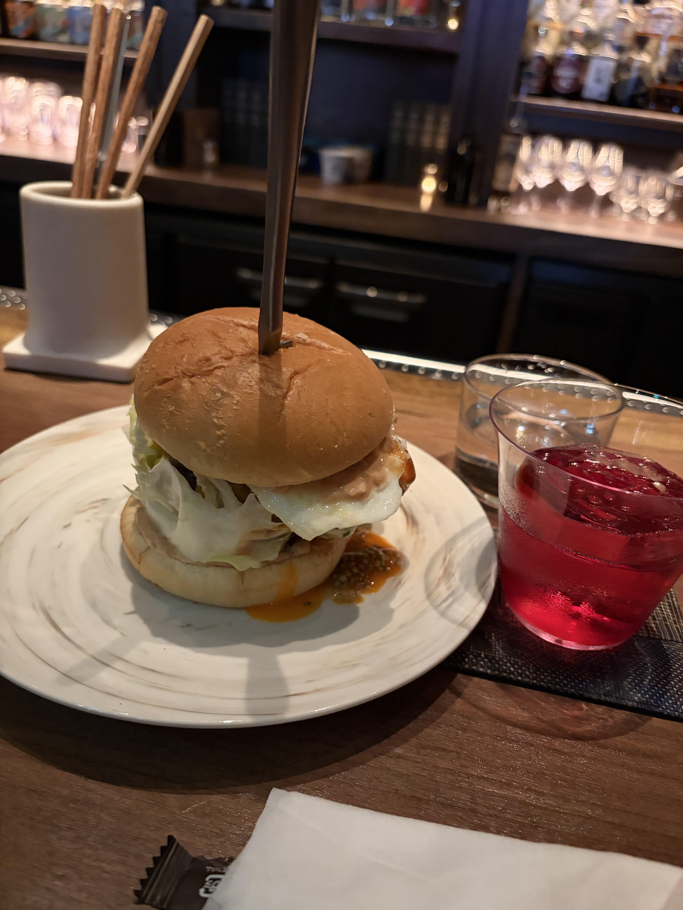

#### Negroni

---

ほろ苦さと甘さが絶妙なとても美味しいカクテルです． 
Bar Thistleで長坂さんの誕生日イベントの日に西山さんにスローイングで作っていただいたのは良い思い出です．(誕生日に本人は怪我でシェイクできなかったの可哀想すぎますね．．．)

<li>
20ml. gin
</li>
<li>
20ml. campari
</li>
<li>
20ml. sweet vermouth
</li>

イタリアのフィレンツェの老舗レストランのカフェ・カソー二の常連客だったカミーロ・ネグローニ伯爵がカンパリとスイートベルモットのソーダ割りのアメリカーノに物足りなさを感じ，ロンドン旅行の土産話としてジンを加えたことが始まりという説もあるようです．

---

Jade labでは藤井さんにブラッドオレンジのアマーロで作っていただきました． 
少し果肉が入っているのでシェイクで作っていただきましたが，すっきりとしていてとても美味しかったです．

SG Tavernでは亀井さんに紫芋感じるネグローニをいただきました． 
SG Tavernは料理も美味しく，相性抜群でした．

---

**[一覧に戻る](/alcohol)**