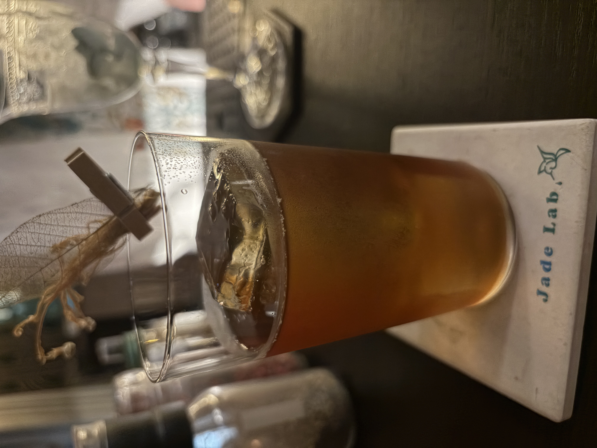

#### Old Fashiond Tea Highboll

---

Bar Amberで入さんにつくっていただいたカクテルです． 
世界中で愛されてるカクテルを日本中で愛されるお茶割りスタイルに 
香り高く奥深い味わいを 
<li>
bourbon
</li>
<li>
maple syrup
</li>
<li>
japanese black tea
</li>
<li>
angostura bitters
</li>
<li>
orange slice
</li>

香り高く飲みやすく，最高に美味しかったです．

Jade Labの藤井さんのオールドファッションドのお茶割りは香り高くもカクテルの骨格はしっかりしていてとても美味しかったです．

---

**[一覧に戻る](/alcohol)**