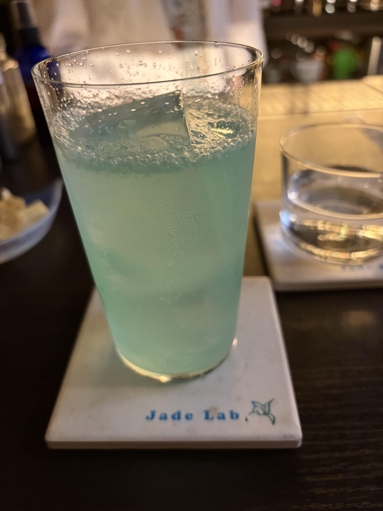

#### Peacock Tonic

---

Jade Labで藤井さんに作っていただいたすっきり飲みやすいカクテルです．

<li>
20ml. green chartreuse
</li>
<li>
10ml. dry gin
</li>
<li>
10ml. lime juice
</li>
<li>
1tsp. blue curacao
</li>
<li>
full up. tonic water
</li>

藤井さんに紹介していただいたシャルトリューズの本から気になったカクテルですが，Martha Stewartさんが考えたもののようです． 
本家のレシピにライムジュースは入ってないですが，甘すぎないようにライムでしめてすっきり美味しかったです．

---

**[一覧に戻る](/alcohol)**