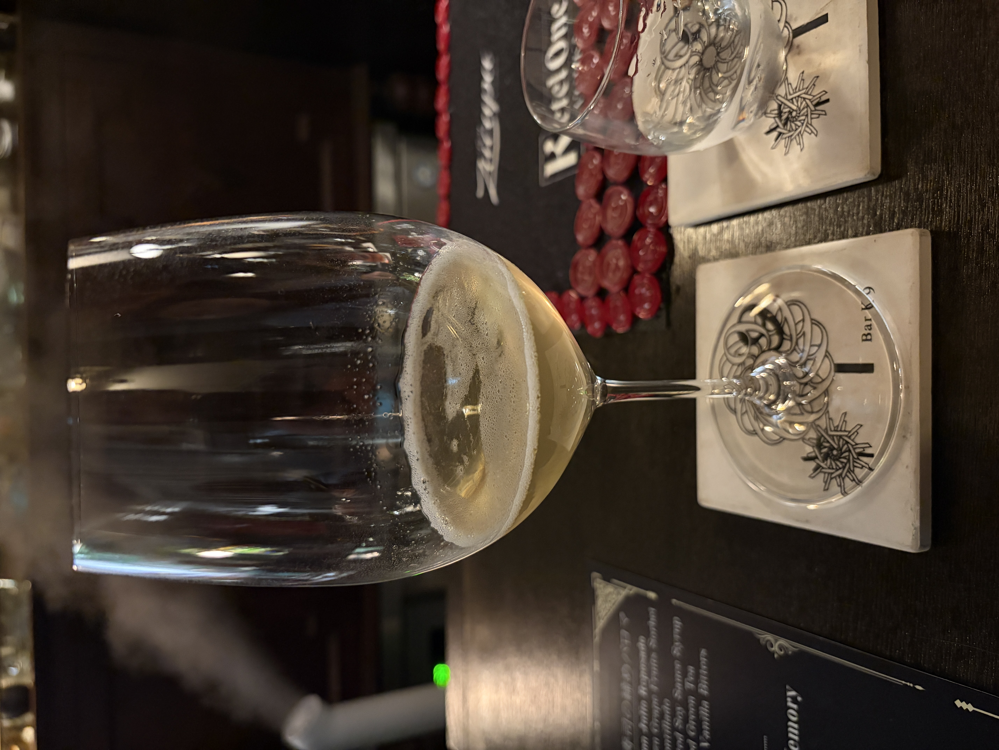

#### Stay Gold

---

Bar K9さんのゲストシフトイベントで岸田さんにつくっていただいたカクテルです．
<li>
Don Julio 1942
</li>
<li>
芋焼酎　彩響
</li>
<li>
Coffee Pineapple Cordial
</li>
<li>
Savory Verjus
</li>
<li>
Calvados
</li>

まるでとても良いワインをいただいているようなとても素晴らしいカクテルでした． 
ゆったり飲むのに最適でこのカクテルを飲んでいる時はとても良い時間が流れていました．

---

**[一覧に戻る](/alcohol)**