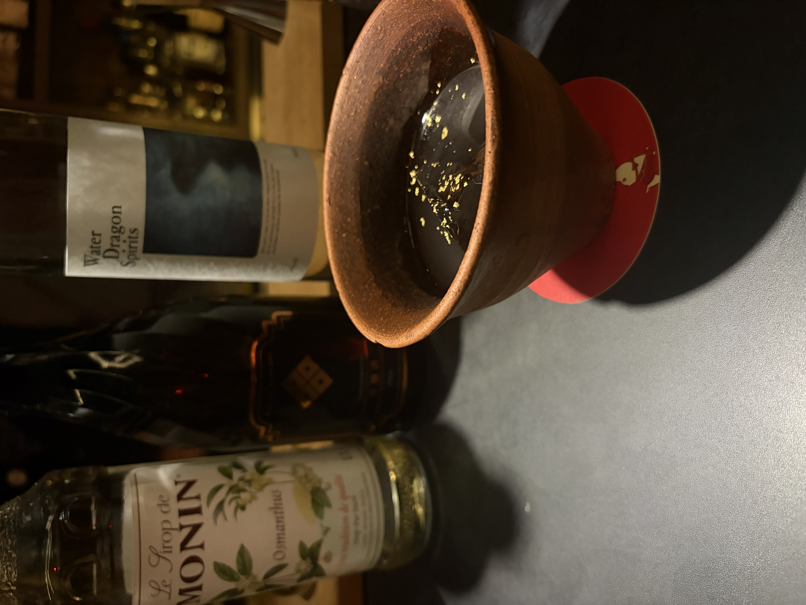

#### Yeah, Surely...

---

The HISAKAで大石さんにいただいたムーンシャインコンペのカクテルです． 

<li>
30ml. water dragon spirits
</li>
<li>
20ml. 貴醸酒
</li>
<li>
10ml. 神社シロップ(金木犀・生姜)
</li>

甘さでまったりしつつも余韻は爽やかでとても面白いカクテルです．

参考文献 
[大石さんの解説](https://www.instagram.com/p/DPZKET-j-S6/?igsh=cHpyOWo2MWdzamZ1)

---

**[一覧に戻る](/alcohol)**