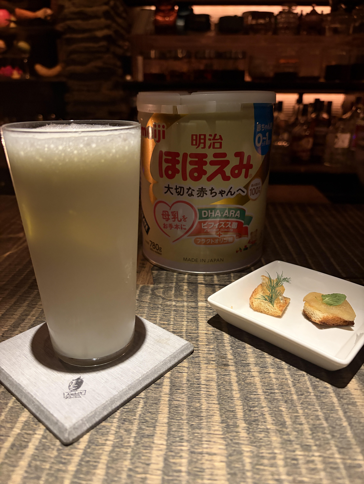

#### よしよし會館フィズ

---

Bar Amberで伊藤さんに作ってもらったノンアルコールカクテルです．

<li>
育児用粉ミルク
</li>
<li>
ライチ
</li>
<li>
エルダーフラワー
</li>
<li>
オレンジフラワー
</li>

Bar小鳥遊さんの人気カクテルをインスパイヤした母性溢れる素晴らしいカクテルです．

---

**[一覧に戻る](/alcohol)**