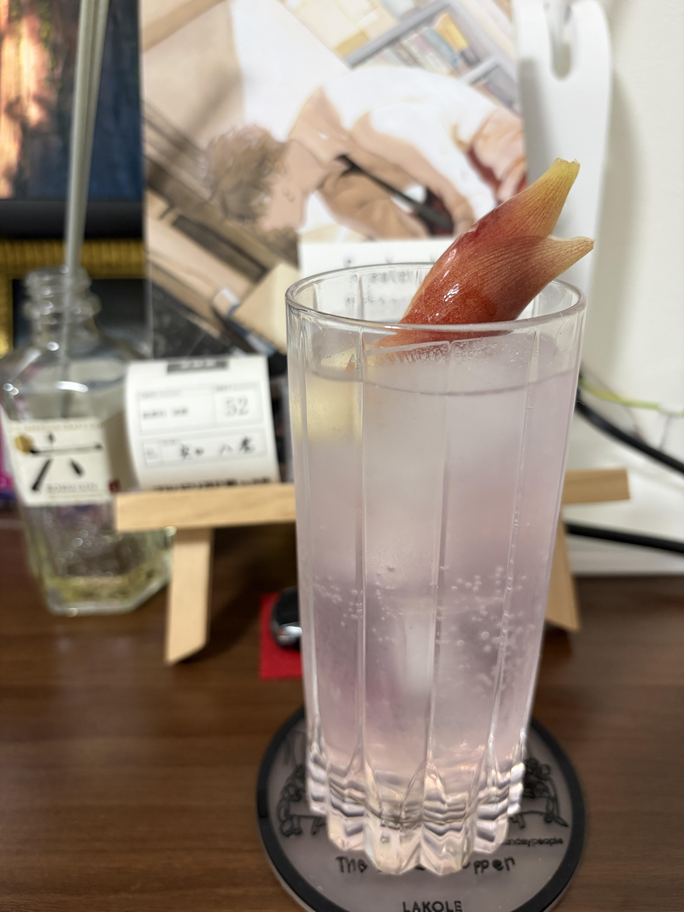

#### 和香るジントニック

---

Bar B&Fで茗荷のカクテルをいただいてとても美味しく，家でも作りたかったので鹿山さんの動画を参考に作ってみました．
<li>
1 ½ oz. gin
</li>
<li>
1. myoga
</li>
<li>
1 tsp. freshly pressed lime juice
</li>
<li>
full up. tonic woter
</li>

簡単に作ることができ，食事に合わせることができるので個人的にお気に入りのカクテルです． 
茗荷の美しい色で香りもよく最高です．

参考文献 
[鹿山さんの動画](https://youtu.be/l04MlWqJDIU?si=Tol5FPS9dGvr9-TU)

---

**[一覧に戻る](/alcohol)**