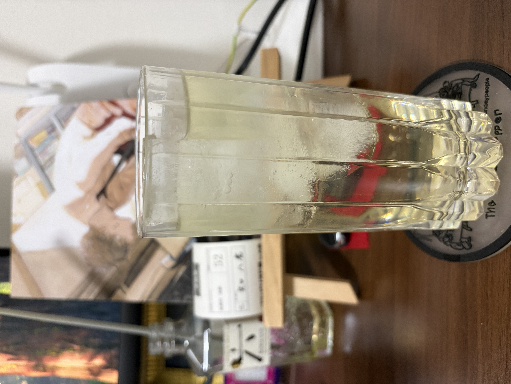

#### 白茶ジントニック

---

Mixology salonの煎茶ジントニックが美味しかったので同じように白茶でつくってみました．
<li>
1 oz. gin infused with hakutya
</li>
<li>
¾ oz. soda
<li>
2 ¾ oz. tonic woter
</li>

白茶の爽やかさとトニックウォーターの甘味がとてもよく美味しかったです． 
今回はネパールの1stフラッシュのジュンチャバリ茶園のヒマラヤンホワイト・可憐を使ってみました．
艶やかで可憐な香りとフルーティな甘味があるお茶です．

参考文献 
[南雲さんの動画](https://youtu.be/f8qbvWKObD0?si=eyRzqjAxm0ytvZ_u)

---

**[一覧に戻る](/alcohol)**