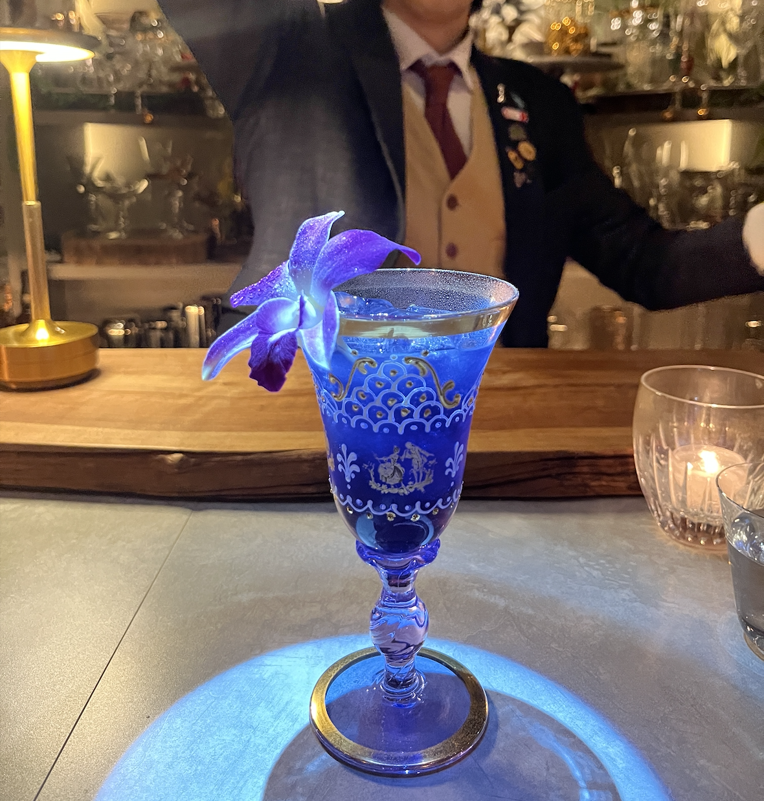

#### 飲む香水

---

Bar Crossingで村上さんにつくっていただきました．
<li>
1 oz. pisco porton
</li>
<li>
1 oz. "飲む香水"liquid 
parfait amour liqueur，elderflower liqueur，lavender syrupをブレンド
</li>
<li>
½ oz. freshly lemon juice
</li>
<li>
3 push. damask rose water
</li>
<li>
1. denfare
</li>

銀座のバレンタインイベントでAirgeadのチョコレートと合わせて初めて飲んだのですがとても香りが良く繊細で美味しくてBar Crossingにも行きました．

参考文献 
[村上さんの動画](https://youtu.be/gquOm7D4kyE?si=94qUZrEjclqwDxWJ)

---

**[一覧に戻る](/alcohol)**