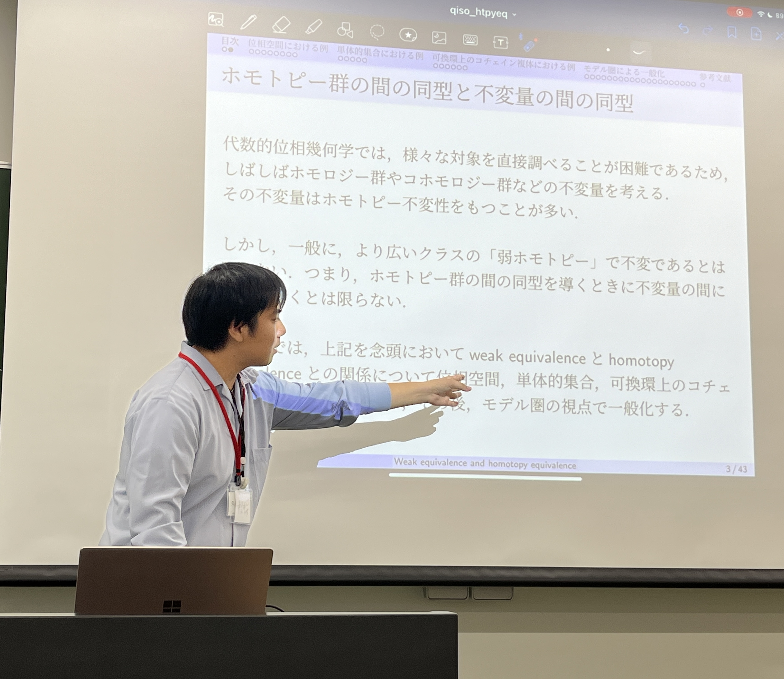

# たくさんの猫と豊かな世界
<!-- [sample pdf](pdf/sample_diagram.pdf) -->

---

### 自己紹介
数学を勉強しています．
特に「空間」や「代数」に興味があります．
学生時代は代数的位相幾何学を専門に研究していました．
現在は自動車関係のデータ分析をしています．

---
### サイトマップ

#### <a href="/notes">まとめノート</a>
書いた記事やノートをまとめてあります．

#### <a href="/adjoint">随伴図鑑</a>
随伴をまとめてあります．

#### <a href="/posts">文献紹介</a>
様々な分野の文献を紹介します．

#### <a href="/omnibus">オムニバス形式セミナーの記録</a>
主催しているオムニバス形式セミナーがまとめてあります．

#### <a href="/links">過去の講演記録</a>
過去の講演資料がまとめてあります．

#### <a href="/errata">誤植表</a>
誤植表がまとめてあります．

#### 連絡先
- Twitter: [@cosmos8128](https://twitter.com/@cosmos8128)
- Twitter: [@cosmos9651](https://twitter.com/@cosmos9651)

#### ブログ
- [はてなブログ](https://ibu8128.hatenablog.com)

