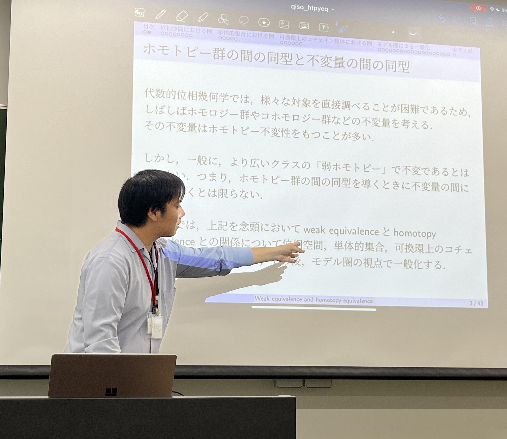

# たくさんの猫と豊かな世界
<!-- [sample pdf](pdf/sample_diagram.pdf) -->

---

## 自己紹介
数学を勉強しています．
特に「空間」と「代数」の双対性に興味があります． 
学生時代は代数的位相幾何学を専門に研究していました． 
現在は自動車関係のデータ分析をしています．

---

## 論文

- Manifolds and fat smooth CW complexes 
Yuki Kojima. Manifolds and fat smooth CW complexes. Master’s thesis, Kyushu University, 2023.

- [A closed manifolds is a fat CW complex](https://arxiv.org/abs/2309.07379) 
Norio Iwase, Yuki Kojima. A closed manifolds is a fat CW complex. 2025. arXiv preprint, https://arxiv.org/abs/2309.07379

## 講演

- 東京大学ミニトポロジーセミナー 
タイトル：Ω-spectrum and cohomology theory

- [九州大学トポロジー金曜セミナー](https://www.math.kyushu-u.ac.jp/activities/2476/) 
タイトル：Reflexivity and a fat smooth CW complex

- [日本数学会九州支部例会](https://www2.math.kyushu-u.ac.jp/~kyushushibu/PDF/148_spring_meeting_program.pdf) 
タイトル：Reflexivity and a fat smooth CW complex

- [Building-up Differential Homotopy Theory 2026](https://www2.math.kyushu-u.ac.jp/~iwase/BDHT5/Home.html) 
タイトル：A closed manifolds is a fat CW complex

## 表彰

- [立命館大学第21回(2020年度)数物会賞](https://www.subutsu.com/?page_id=10) 
「ホモトピー論」　(福本・野澤・多羅間 研究室)

## サイトマップ

### <a href="/notes">まとめノート</a>
書いた記事やノートをまとめてあります．

### <a href="/adjoint">随伴図鑑</a>
随伴関手をまとめてあります．

### <a href="/posts">文献紹介</a>
様々な分野の文献を紹介します．

### <a href="/omnibus">オムニバス形式セミナーの記録</a>
主催しているオムニバス形式セミナーがまとめてあります．

### <a href="/links">過去の講演記録</a>
過去の講演資料がまとめてあります．

### <a href="/errata">誤植表</a>
誤植表がまとめてあります．

### <a href="/tea_dj">紅茶紹介</a>
美味しい紅茶を紹介します．

#### <a href="/alcohol">お酒紹介</a>
美味しいお酒を紹介します．

#### 連絡先
- Twitter: [@cosmos8128](https://twitter.com/@cosmos8128)
- Twitter: [@cosmos9651](https://twitter.com/@cosmos9651)

#### ブログ
- [はてなブログ](https://ibu8128.hatenablog.com)

