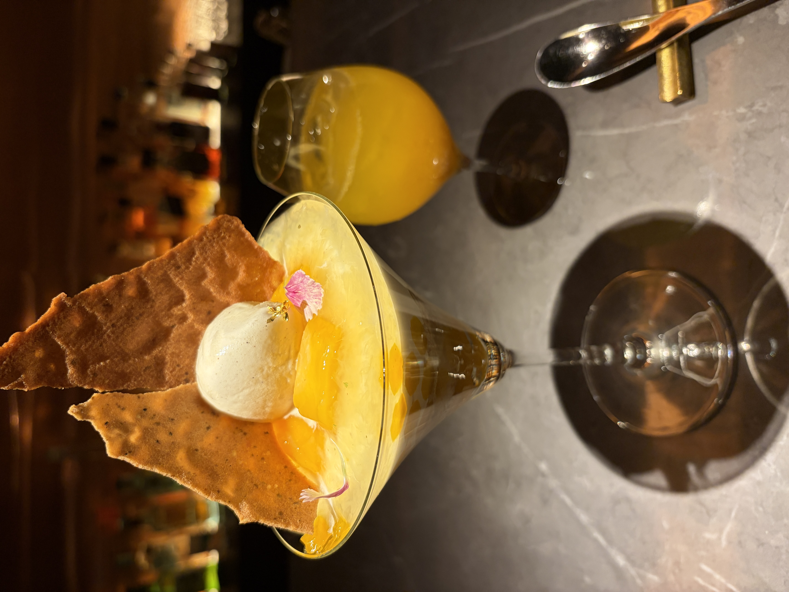
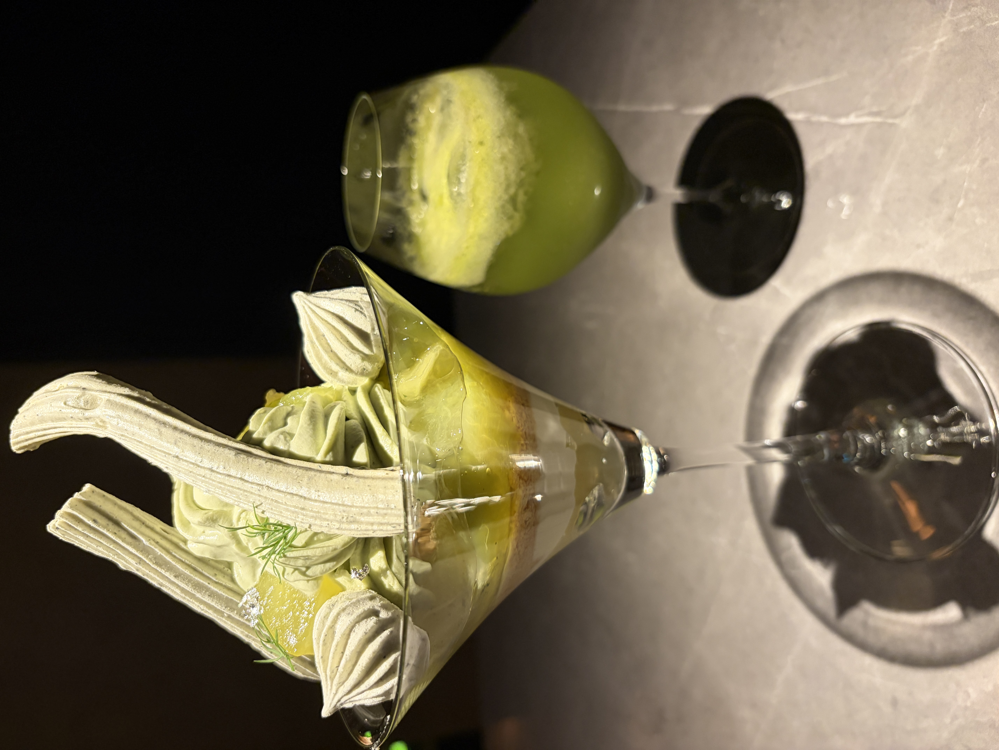
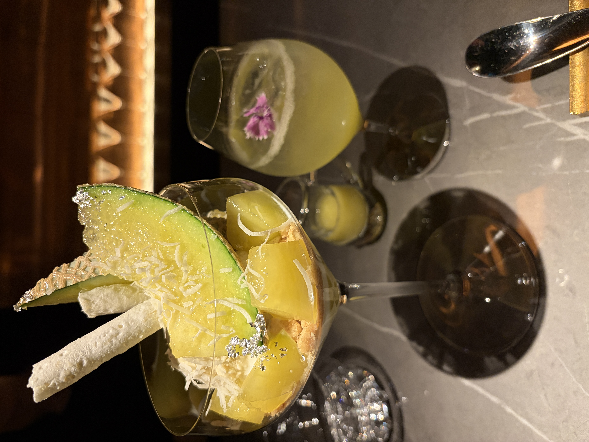
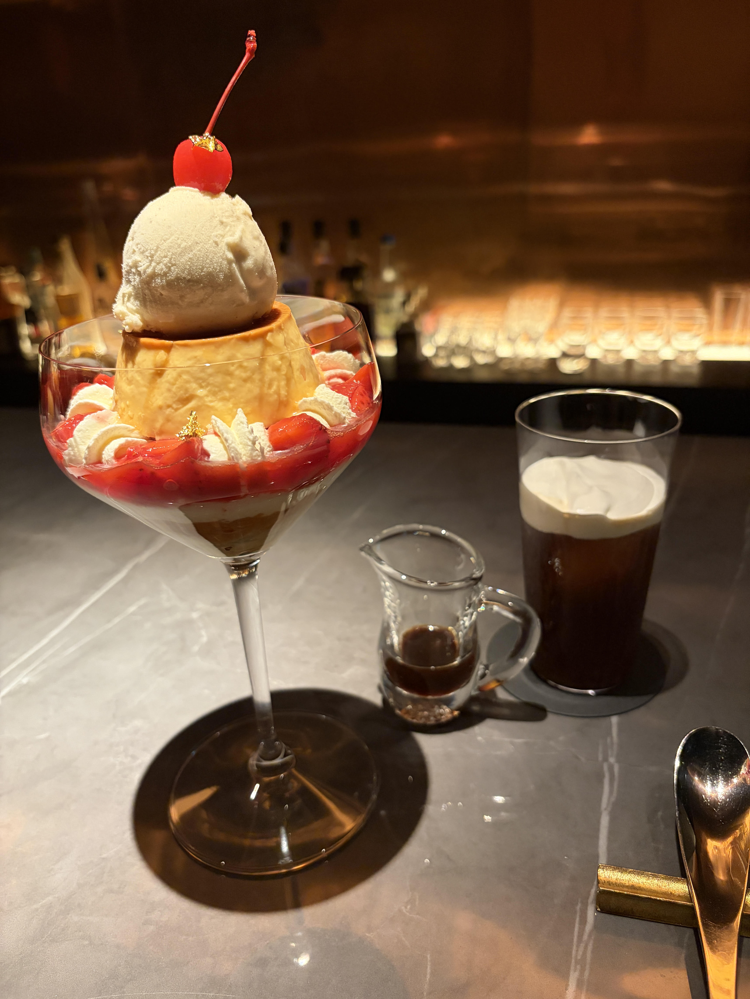
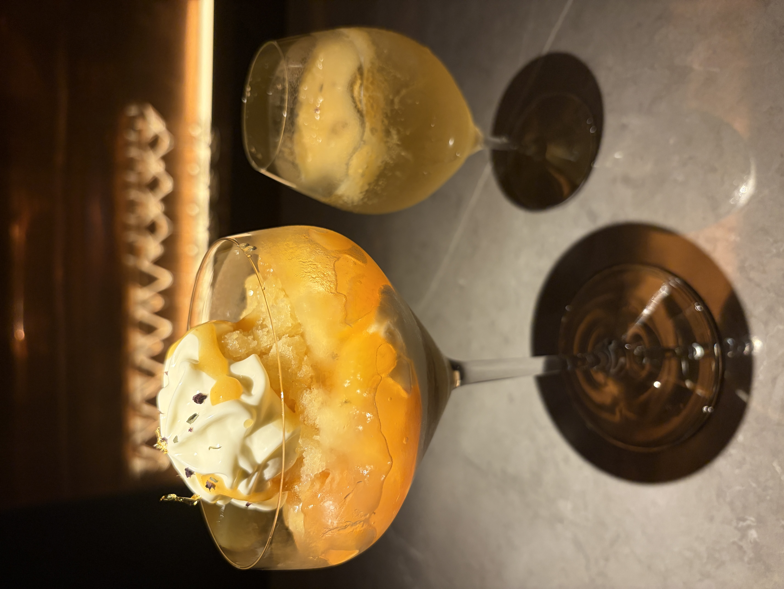
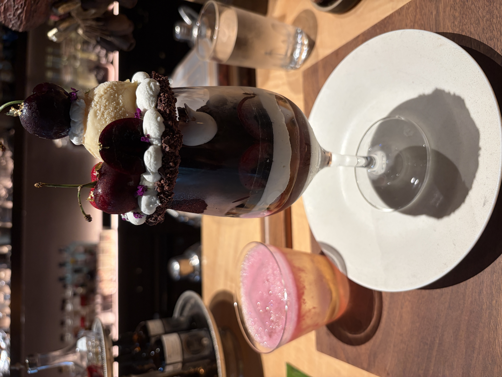
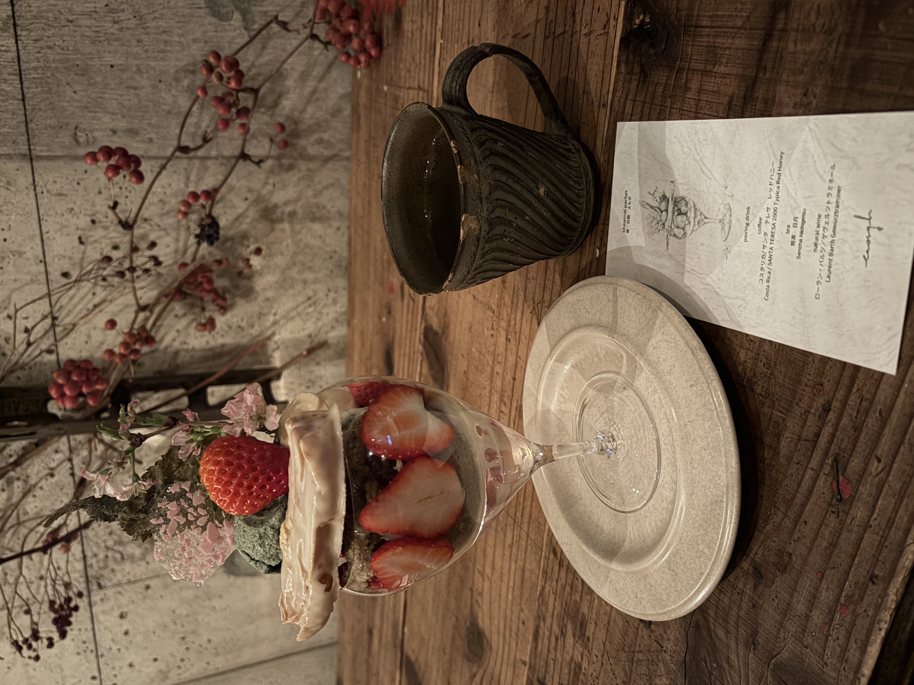
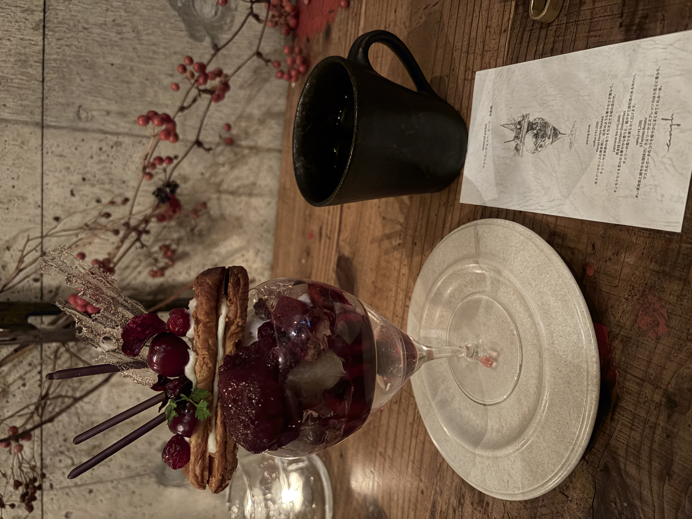
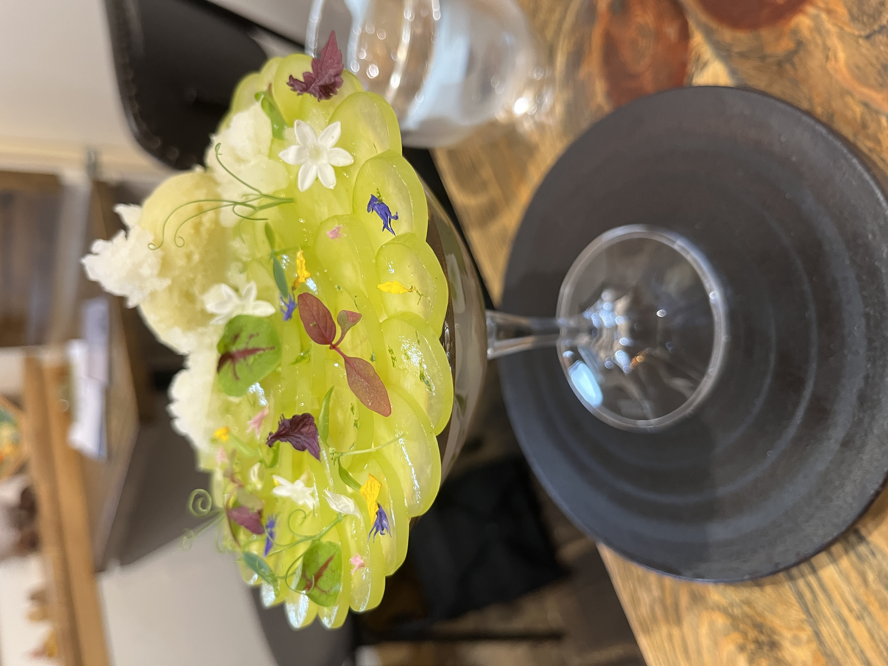

## **パフェ紹介**
私が今まで食べて美味しかったパフェを紹介します．

---

Remake easyの4月の限定パフェは宮崎県産マンゴーと日向夏の天孫の春うららパフェでした！ 
柑橘の酸味と華やかさが素晴らしく美味しかったです．

[noteでの解説](https://note.com/remakeeasy/n/n4888cbf83e23)

Remake easyの5月の限定パフェは八女茶とマスクメロンの利休ヴァシュランパフェでした！ 
メロンのウリっぽさとお茶の相性が素晴らしく美味しかったです．

[noteでの解説](https://note.com/remakeeasy/n/n9c1b89243752)

Remake easyのゴールデンウィークのイベントで札幌店の限定パフェの日本酒とメロンのパフェをいただきました！ 
メロンの嫌なウリっぽさが一切ない様な日本酒の合わせ方でとても美味しかったです．

Remake easyの名古屋店の限定パフェのプリンアラモードのパフェをいただきました！ 
プリンの口当たりと濃厚さに感動し，コーヒーとの相性が素晴らしく美味しかったです．

Remake easyの6月の限定パフェは茉莉花香るミラベルとプラムの杏仁パフェでした！ 
杏仁豆腐の再構成という感じでとても美味しかったです．

[noteでの解説](https://note.com/remakeeasy/n/n9e7e81d1434e)

mementomoriの5月の限定パフェは春の花束を味わう大人のパフェでした！ 
ミモザの花をイメージした柑橘系のパフェでとても美味しかったです． 
合わせる浦里さんのカクテルは華やかな春を感じるシュトーレンの様なカクテルで相性抜群でした．

mementomoriの6月の限定パフェはアメリカンチェリーと深く濃厚なカカオのシックなパフェでした！ 
アメリカンチェリーの濃厚な甘さとカカオのビターな深みが心地よいパフェでとても美味しかったです． 
合わせる浦里さんのカクテルは華やかなバラ香るカクテルでとても美味しかったです．

enoughの3月のパフェは桜 白餡 よもぎのパフェでした！ 
まるで苺大福や三色団子の様な複雑な味わいで春を感じることができて素晴らしく美味しかったです．

enoughの6月のパフェはチェリー　ビーツ　赤紫蘇のパフェでした！ 
アメリカンチェリーのみずみずしい果実感とビーツと赤紫蘇の酸味の相性がとても良く，複雑な味わいでとても美味しかったです．

しましまの木ではアメリカンチェリーと花の香りのパフェをいただきました！ 
フィレッシュなアメリカンチェリーや生クリームやラベンダーのチーズケーキの相性が良く，とても調和が取れており，さらにレモンタイムを散らしながらアクセントを加えて甘すぎない味わいにまとまってとても美味しかったです．

Cafe & Nではシャインマスカットのパフェをいただきました！ 
みずみずしいシャインマスカットを活かすパフェでとても美味しかったです．

---

**[ホームに戻る](/index)**