

## **紅茶紹介**
私が今まで飲んで美味しかった紅茶を紹介します．

### DARJEELING

ダージリンはインドにある北緯26度27分から27度13分，東経87度59分から88度53分の約31万4900haほどの土地で80を超える茶園をもつ紅茶の名産地です． 
作付面積は約1万4900haで大体利尻島ほどの小さな区画で紅茶が作られています．

#### 1st Flush

  

    
2025 ROHINI農園 Moonlight EX-1

    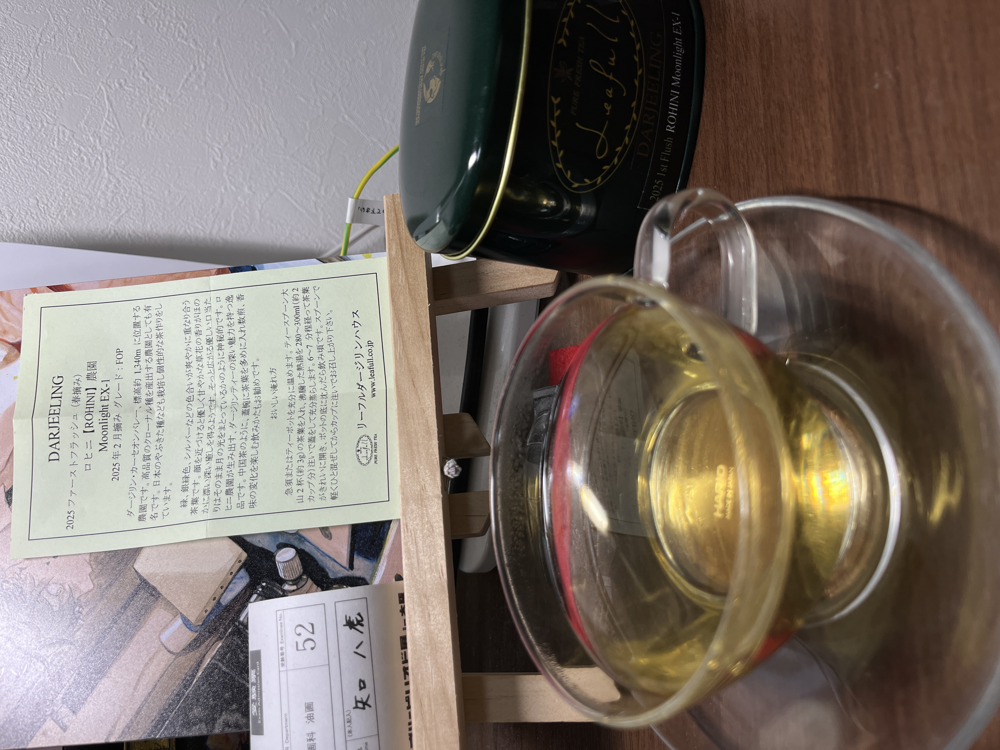
    
やさしい香りがとても良く，口当たりも優しく，まさに月の光のようなとてもまろやかな甘みを感じられてすごく美味しいです．
    物足りないと感じる人もいなくはなく，好みは分かれそうですが，私はとても好みで絶品でした．
    少し多めの茶葉で数杯楽しむのもとても良いと思います．

  

  

    
2025 ARYA農園 China EX-10

    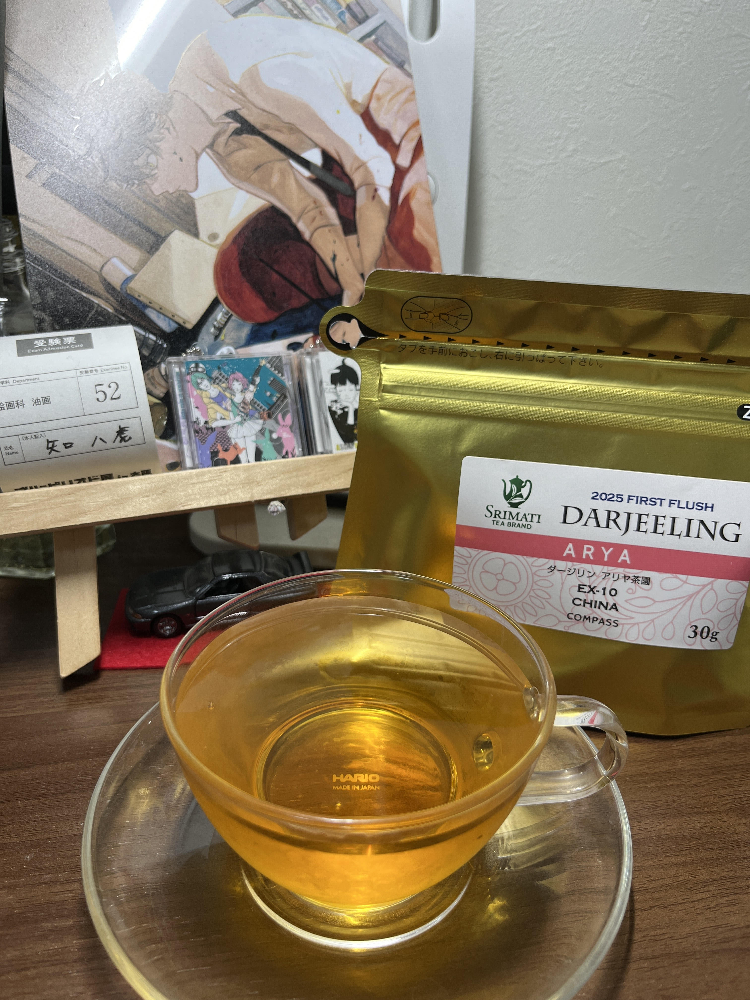
    
若々しい爽やかな香りで心地良い渋みと優しい甘みを感じられてとても美味しいです． 
    アイスティも美味しいですが，個人的にはホットが好みでした．
    お湯の温度を80度くらいまで下げ，少し長い時間抽出することで心地良い渋みを残しながらも口当たりを優しくして飲むことができるのでおすすめです．

  

  

    
2024 ARYA農園 Diamond EX-28

    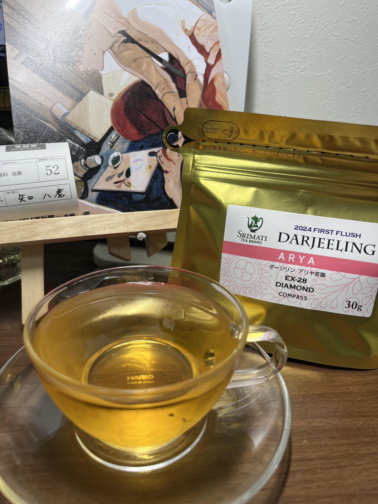
    
華やかなやさしい香りですっきりとしていて渋みが少なく，透明感のあるまろやかな味わいでホットはもちろん，アイスティにするととても美味しいです． 
    2024年の1st flushでは個人的に1番好みでした．

  

  

    
2024 THURBO農園 Clonal DJ-12

    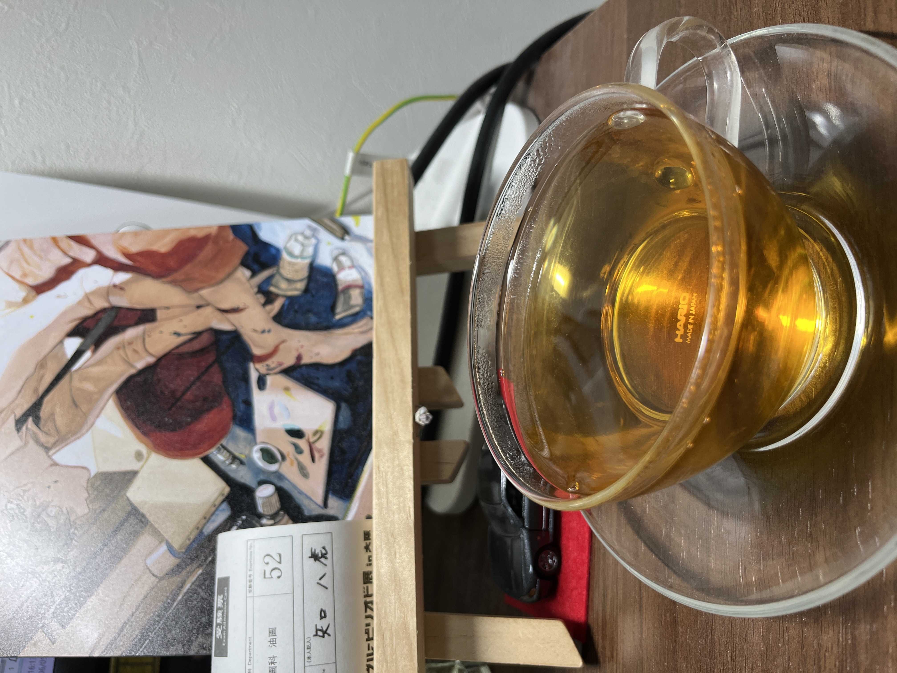
    
ホットはもちろんですが，アイスティにすると淡い甘味が良くでてとても美味しいです．
    甘味だけでなく，しっかりした部分もあり，バランスの良い味だと思います．

  

  

    
2023 RISHEEHAT農園 China EX-12

    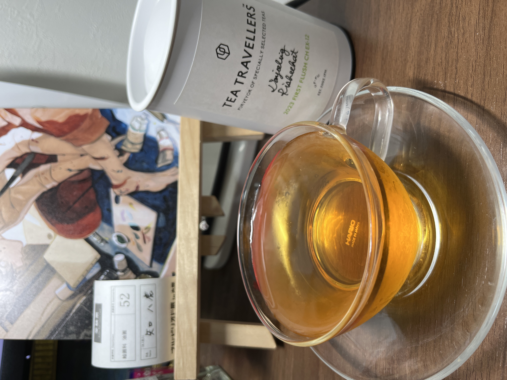
    
華やかな温かみを感じる香りで優しい甘みがあり，とても美味しいです． 
    ホットでもアイスティでも間違いなく美味しく，私が紅茶にハマったきっかけの1杯です．

  

  <!-- 

    
2024 THURBO農園 Clonal DJ-12

    
    
ホットはもちろんですが，アイスティにすると淡い甘味が良くでてとても美味しいです．
甘味だけでなく，しっかりした部分もあり，バランスの良い味だと思います．

  
 -->

<!-- - 2025 ROHINI農園 Moonlight EX-1

やさしい香りがとても良く，口当たりも優しく，まさに月の光のようなとてもまろやかな甘みを感じられてすごく美味しいです．
物足りないと感じる人もいなくはなく，好みは分かれそうですが，私はとても好みで絶品でした．
少し多めの茶葉で数杯楽しむのもとても良いと思います．

<!-- - 2025 ARYA農園 China EX-10

若々しい爽やかな香りで心地良い渋みと優しい甘みを感じられてとても美味しいです．
アイスティも美味しいですが，個人的にはホットが好みでした．
お湯の温度を80度くらいまで下げ，少し長い時間抽出することで心地良い渋みを残しながらも口当たりを優しくして飲むことができるのでおすすめです．

- 2024 ARYA農園 Diamond EX-28

華やかなやさしい香りですっきりとしていて渋みが少なく，透明感のあるまろやかな味わいでホットはもちろん，アイスティにするととても美味しいです．
2024年の1st flushでは個人的に1番好みでした．

 -->

<!-- - 2024 THURBO農園 Clonal DJ-12

ホットはもちろんですが，アイスティにすると淡い甘味が良くでてとても美味しいです．
甘味だけでなく，しっかりした部分もあり，バランスの良い味だと思います．

 -->

<!-- - 2023 RISHEEHAT農園 China EX-12

華やかな温かみを感じる香りで優しい甘みがあり，とても美味しいです．
ホットでもアイスティでも間違いなく美味しく，私が紅茶にハマったきっかけの1杯です．

 -->

#### 2nd Flush

  

    
2024 SINGBRULI農園 China Musk EX-50

    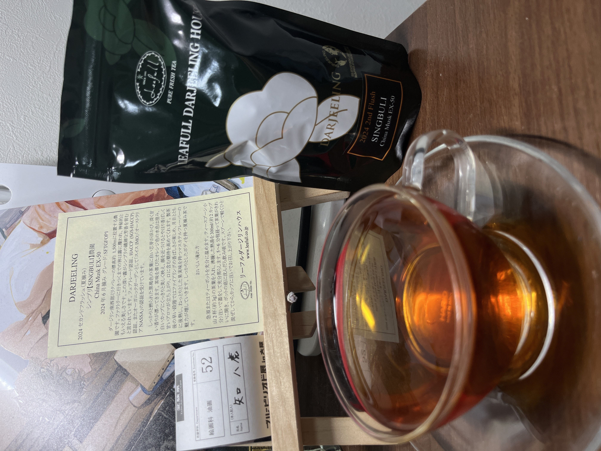
    
香ばしくとても甘い良い香りでしっかりとした深い甘味でとても美味しいです． 
    2024年の2nd flushでは個人的に1番好みでした．

  

  

    
2024 SINGBRULI農園 China Musk DJ-93

    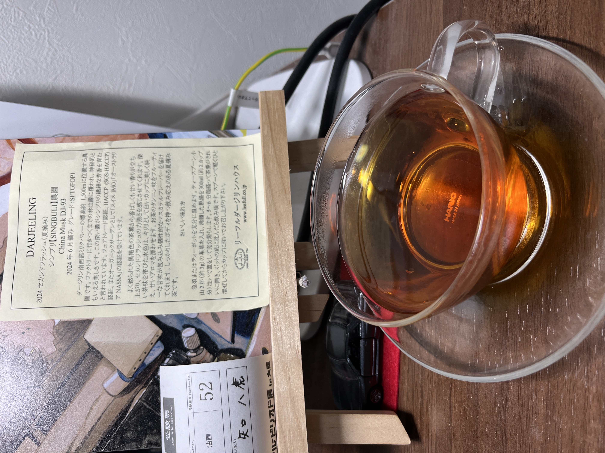
    
香ばしく甘い香りでしっかりとした飲み応えがあり，とても美味しいです．
    バランスの良い間違いないものだと思います．

  

<!-- - 2024 SINGBRULI農園 China Musk EX-50

香ばしくとても甘い良い香りでしっかりとした深い甘味でとても美味しいです．
2024年の2nd flushでは個人的に1番好みでした．

- 2024 SINGBRULI農園 China Musk DJ-93

香ばしく甘い香りでしっかりとした飲み応えがあり，とても美味しいです．
バランスの良い間違いないものだと思います．

 -->

### ASSAM

アッサムはインド北東のヒマラヤ山脈の麓，ブラマプトラ川流域の平野部に位置する紅茶の名産地であり，ダージリンが山間部であることに比べると平原で高温多湿であることから力強い風味をもつアッサム種の茶葉が栽培されています．

#### 1st Flush

#### 2nd Flush

  

    
2024 HATTIALLI農園 STGFOP1

    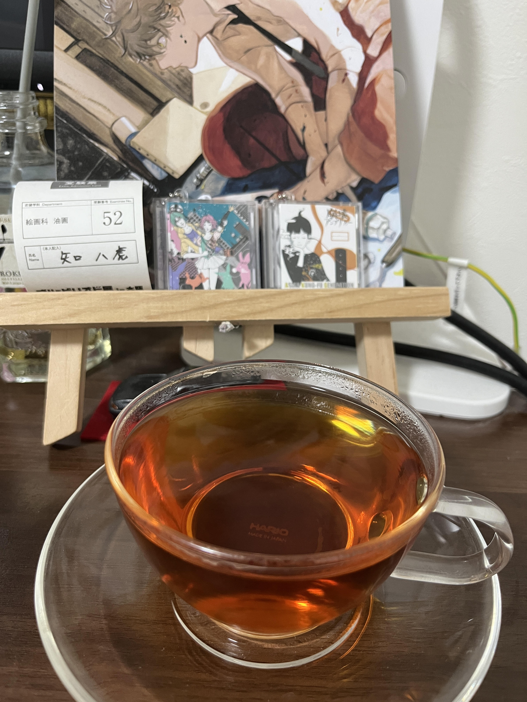
    
モルティな香ばしい良い香りで厚みがある濃厚で深いコクがあるのですが，その中にまろやかさがあり，とてもバランスが良く美味しいです． 
    この茶葉は他のものに比べて特に香りが強く個人的に好みです．
    ストレートはもちろん，ミルクティも美味しかったです．
    個人的にはストレートでゆーーっくり飲むことで温度変化により香りや味が変わるのを楽しむのが好みです．

  

  

    
2024 DOOMNI農園 TGFOP1

    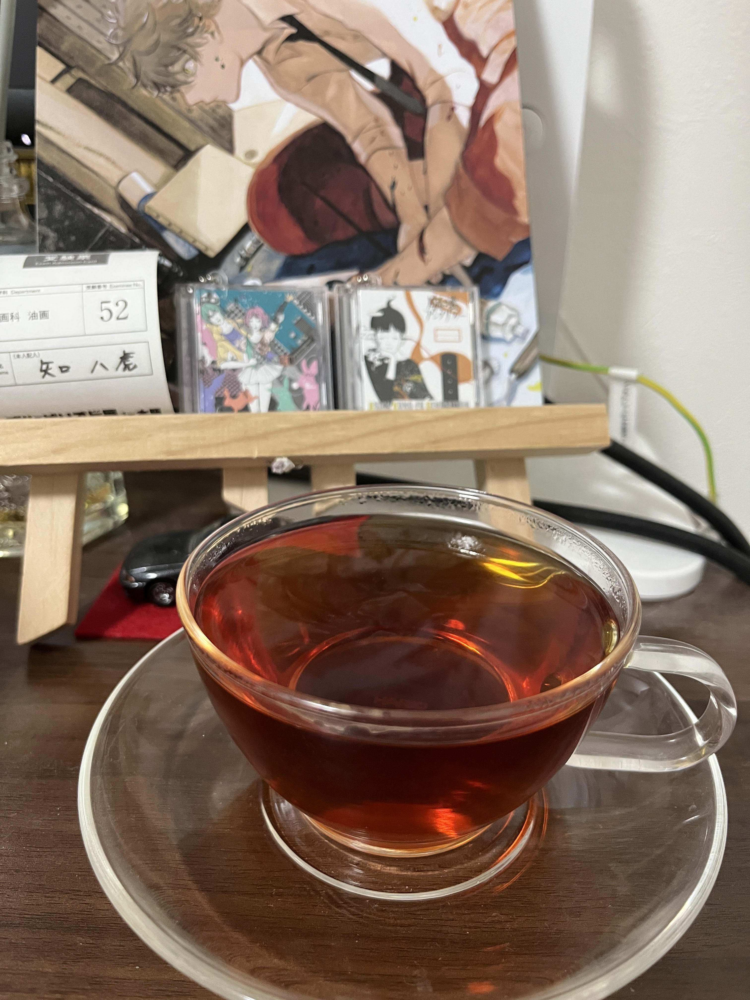
    
ハーブの様な少し清涼感のある良い香りで深く厚みがあり，心地よい渋みを感じられてとても美味しかったです． 
    ストレートはもちろん，ミルクティも美味しかったです．
    深く厚みがあるので少し多めのお湯と茶葉で淹れて1杯目はストレートで楽しみ，2杯目や3杯目にミルクティや砂糖を入れて楽しむのが個人的に好きです．

  

  

    
2024 HALMARI農園 TGFOP Cl

    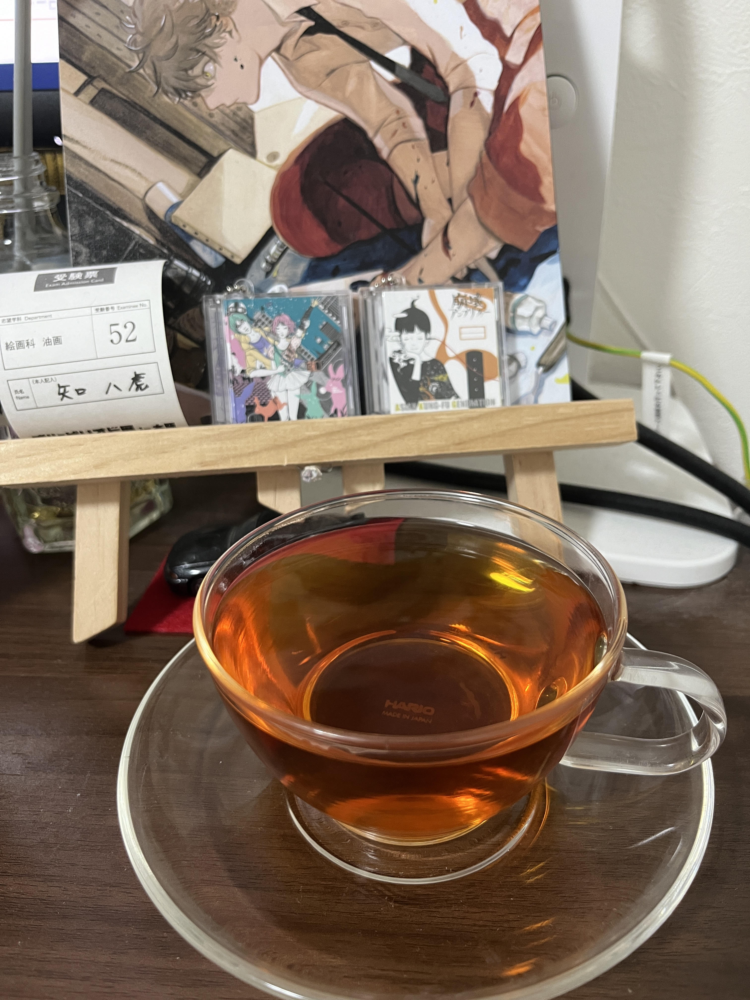
    
とてもフローラルな良い香りで濃密ながらキレのある風味でとても美味しかったです． 
    ミルクティもアイスティも美味しいですが，私は華やかな香りを1番楽しめるホットのストレートティが好みでした． 
    ドイツ・東フリースラント式のアレンジティにしても美味しいらしいです．(Gclefさんが紹介していました．) 
    氷砂糖をカップに入れて，熱々の紅茶を注ぎ，最後にクリームを加えて混ぜずに味のグラデーションを楽しむ形です．
    氷砂糖のまろやかな甘さが徐々に広がりとても美味しかったです．

  

  <!-- 

    
2024 DOOMNI農園 TGFOP1

    
    
ハーブの様な少し清涼感のある良い香りで深く厚みがあり，心地よい渋みを感じられてとても美味しかったです． 
    ストレートはもちろん，ミルクティも美味しかったです．
    深く厚みがあるので少し多めのお湯と茶葉で淹れて1杯目はストレートで楽しみ，2杯目や3杯目にミルクティや砂糖を入れて楽しむのが個人的に好きです．

  
 -->

<!-- - 2024 HATTIALLI農園 STGFOP1

モルティな香ばしい良い香りで厚みがある濃厚で深いコクがあるのですが，その中にまろやかさがあり，とてもバランスが良く美味しいです． 
この茶葉は他のものに比べて特に香りが強く個人的に好みです．
ストレートはもちろん，ミルクティも美味しかったです．
個人的にはストレートでゆーーっくり飲むことで温度変化により香りや味が変わるのを楽しむのが好みです．

- 2024 DOOMNI農園 TGFOP1

ハーブの様な少し清涼感のある良い香りで深く厚みがあり，心地よい渋みを感じられてとても美味しかったです．
ストレートはもちろん，ミルクティも美味しかったです．
深く厚みがあるので少し多めのお湯と茶葉で淹れて1杯目はストレートで楽しみ，2杯目や3杯目にミルクティや砂糖を入れて楽しむのが個人的に好きです．

 -->

<!-- - 2024 HALMARI農園 TGFOP Cl

とてもフローラルな良い香りで濃密ながらキレのある風味でとても美味しかったです．
ミルクティもアイスティも美味しいですが，私は華やかな香りを1番楽しめるホットのストレートティが好みでした． 
ドイツ・東フリースラント式のアレンジティにしても美味しいらしいです．(Gclefさんが紹介していました．) 
氷砂糖をカップに入れて，熱々の紅茶を注ぎ，最後にクリームを加えて混ぜずに味のグラデーションを楽しむ形です． 
氷砂糖のまろやかな甘さが徐々に広がりとても美味しかったです．

 -->

### DOOARS

ドアーズはインド北東部，ヒマラヤ山脈の麓の標高30mから300mの低地でダージリンとアッサムの間に位置する紅茶の名産地です． 
香りと味わいはダージリンとアッサムの良いところどりのものが多く，クオリティーシーズンは秋です．

  

    
2024 PUTHARJHORA農園

    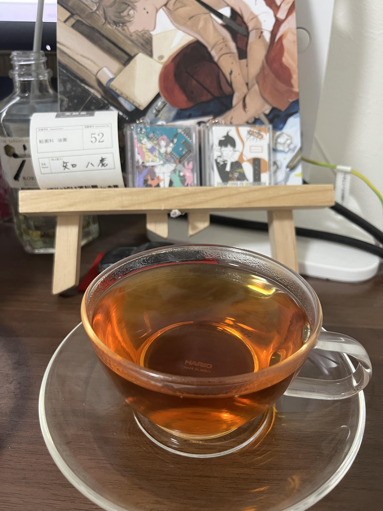
    
どこかダージリンを思わせる様なフローラルな気品ある花の優しい香りでどこかアッサムを思わせる様な重みのある飲み心地でとても美味しいです． 
    ストレートでゆっくり飲むのがおすすめです．
    ゆっくり飲んでいると果実の様なフルーティな香りを感じられてとても美味しいです． 
    ドアーズはダージリンとアッサムの間に位置しますが，本当にどちらの良さも感じられる様な紅茶で面白いです．
    個人的な感覚ですが，この紅茶の風味はどちらかというとアッサムに寄っているかなと思います．

  

  <!-- 

    
2024 DOOMNI農園 TGFOP1

    
    
ハーブの様な少し清涼感のある良い香りで深く厚みがあり，心地よい渋みを感じられてとても美味しかったです． 
    ストレートはもちろん，ミルクティも美味しかったです．
    深く厚みがあるので少し多めのお湯と茶葉で淹れて1杯目はストレートで楽しみ，2杯目や3杯目にミルクティや砂糖を入れて楽しむのが個人的に好きです．

  
 -->

<!-- - 2024 PUTHARJHORA農園

どこかダージリンを思わせる様なフローラルな気品ある花の優しい香りでどこかアッサムを思わせる様な重みのある飲み心地でとても美味しいです．
ストレートでゆっくり飲むのがおすすめです．
ゆっくり飲んでいると果実の様なフルーティな香りを感じられてとても美味しいです．
ドアーズはダージリンとアッサムの間に位置しますが，本当にどちらの良さも感じられる様な紅茶で面白いです．
個人的な感覚ですが，この紅茶の風味はどちらかというとアッサムに寄っているかなと思います．

 -->

### NUWARAELIYA

ヌワラエリヤはスリランカの中央山脈(ピドゥルタラーガラ山)の最高地に位置する紅茶の名産地でハイグロウンに分類されます． 
セイロンティのシャンパンと称されるほど明るい淡い水色に緑茶を思わせる若々しい清涼感のある香りと爽やかですっきりした口当たりのものが多く，冬がクオリティーシーズンです．

  

    
2024 PEDORO茶園 BOP

    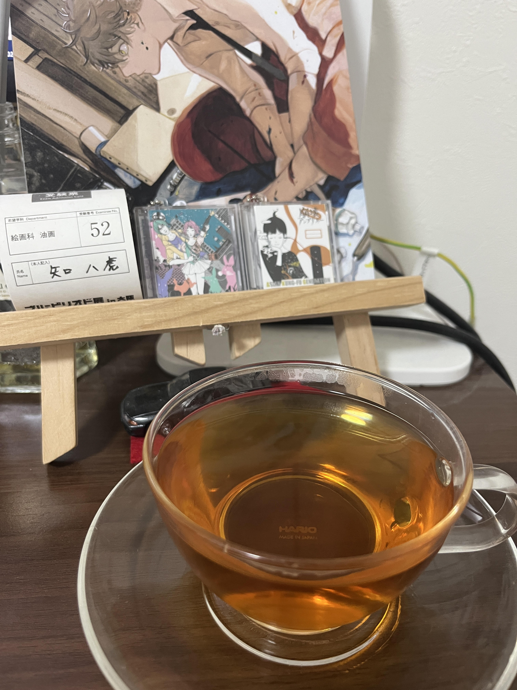
    
若々しい良い香りで華やかな甘みがあってとても美味しいです． 
    余韻にどこか檸檬の様な柑橘系の風味があり，ストレートも良いですが，アイスティも美味しいです．

  

  <!-- 

    
2023 Holyrood茶園 BOP

    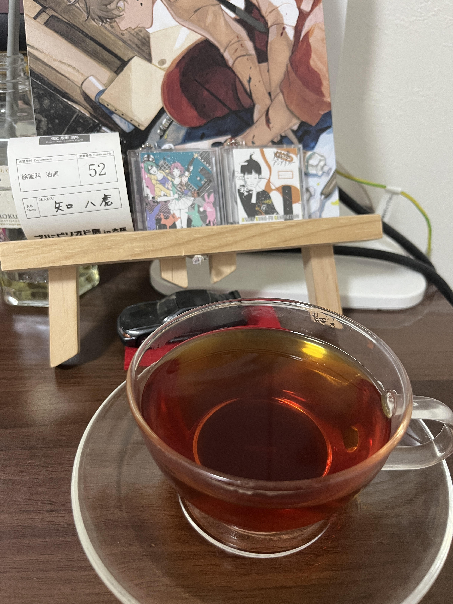
    
ウッディなコクと深みがある味わいがあり，どこか熟したフルーツの様な丸みのある風味を感じてとても美味しいです． 
    1杯目はストレートティで楽しんで，茶葉を入れたままにして濃くなった2杯目をミルクティとして飲むのもおすすめです．

  
 -->

### DIMBULA

ディンブラはスリランカの中央山脈の西側斜面に広がる高地に位置する紅茶の名産地でハイグロウンに分類されます． 
明るい深みのある水色で花の様な華やかな香りでコクが深い味わいのものが多く，北東モンスーンの影響で乾季になる冬がクオリティーシーズンです．

  

    
2024 春茶 GAURAVILLA茶園 BOPF

    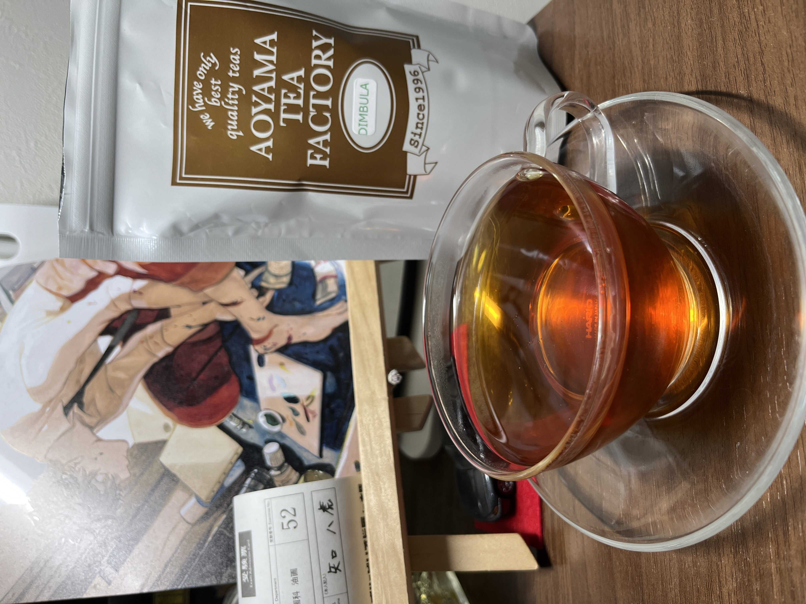
    
しっかりと甘みが強く，とても美味しいです． 
    ストレートも良いですが，ミルクティにすると絶品です．
    少し多めに入れて複数杯目で砂糖を多めに入れたミルクティにして楽しむのがおすすめです．

  

  

    
2023 HOLYROOD茶園 BOP

    
    
ウッディなコクと深みがある味わいがあり，どこか熟したフルーツの様な丸みのある風味を感じてとても美味しいです． 
    1杯目はストレートティで楽しんで，茶葉を入れたままにして濃くなった2杯目をミルクティとして飲むのもおすすめです．

  

<!-- - 2024 ガウラウィラ茶園 BOPF

しっかりと甘みが強く，とても美味しいです．
ストレートも良いですが，ミルクティにすると絶品です．
少し多めに入れて複数杯目で砂糖を多めに入れたミルクティにして楽しむのがおすすめです．

 -->

### UVA

ウバはスリランカの中央山脈の東側斜面に位置する紅茶の名産地でハイグロウンとミディアムグロウンに分類されます． 
水色は明るい透明感のある琥珀色で爽快でキレのある香り(ウバフレーバーとも呼ばれるメンソール系の香り)と味わいのものが多く，南西モンスーンの影響で乾季になる夏がクオリティーシーズンです． 

### UDA PUSSELLAWA 

ウダブッセラワはスリランカの中央山脈東側に位置する紅茶の名産地でハイグロウンとミディアムグロウンに分類されます． 
ヌワラエリヤとウバの間に位置しているので香りと味わいもその良いところどりのものが多く，ヌワラエリヤに面した地域は冬がクオリティーシーズンでウバに面した地域では夏がクオリティーシーズンになります．

### KANDY

キャンディはスリランカ中央部に位置する紅茶の名産地でミディアムグロウンに分類されます． 
水色は明るい赤銅色で穏やかな香りとまろやかな口当たりのものが多いです．

### SABARAGAMUWA

サバラガムワはスリランカの南西部に位置する紅茶の名産地であり，ローグロウンに分類されます． 
元々はルフナとひとまとめにされていましたが，ルフナの様なスモーキーさより黒糖や蜂蜜の様な甘味が特徴的なため独立した産地として確立しました． 
水色は濃い真紅色で濃厚で甘味が強く，コクがある味わいのものが多いです．

  

    
2024 KORONNA茶園 BOP1

    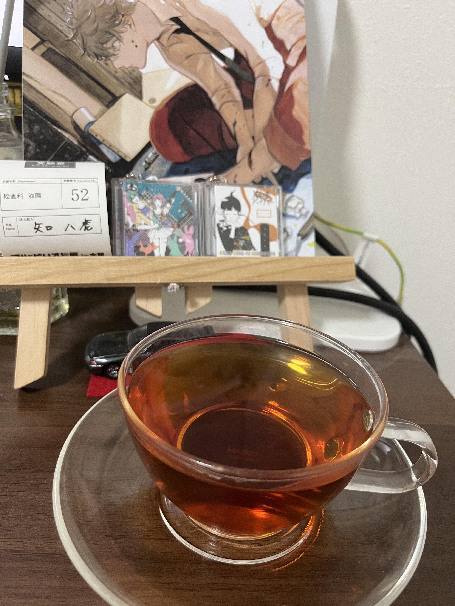
    
深く甘い香りと味でまるで蜂蜜を思わせる様な奥行きを感じられます． 
    嫌な渋みは一切なく，ストレートでゆっくり飲むのがおすすめですが，アイスでも美味しいです．

  

  

    
2024 GALBADI TENNE茶園 PF1

    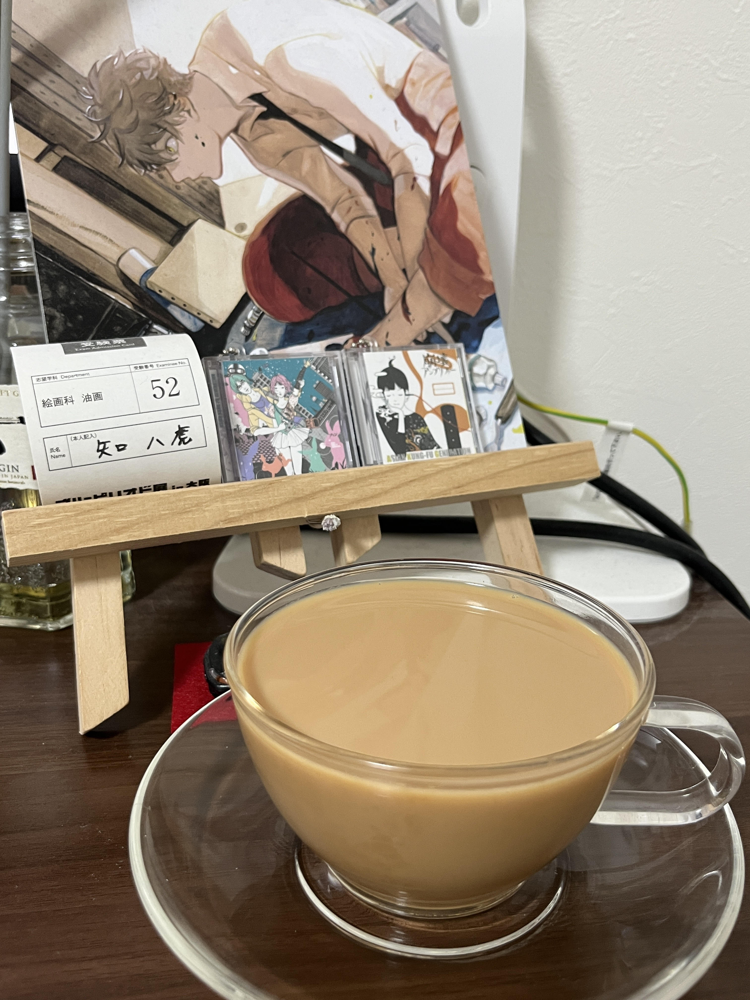
    
深みがあり，とても香ばしい香りでキレのあるミルクティを楽しめます． 
    後味がまるでカフェオレのような飲み心地でとても面白い紅茶です． 
    温度が下がっても余韻が長く，ゆーーっくりと楽しむのがおすすめです．

  

<!-- - 2024 コロンナ茶園 BOP1

深く甘い香りと味でまるで蜂蜜を思わせる様な奥行きを感じられます．
嫌な渋みは一切なく，ストレートでゆっくり飲むのがおすすめですが，アイスでも美味しいです．

 -->

### RUHUNA

ルフナはシンハラ語で南を意味する名の通りスリランカの南に位置する紅茶の名産地でローグロウンに分類されます． 
水色は濃い赤褐色でスモーキーな香りで濃厚で力強いコクがある味わいのものが多いです．

  

    
2024 DELLAWA茶園 BOP

    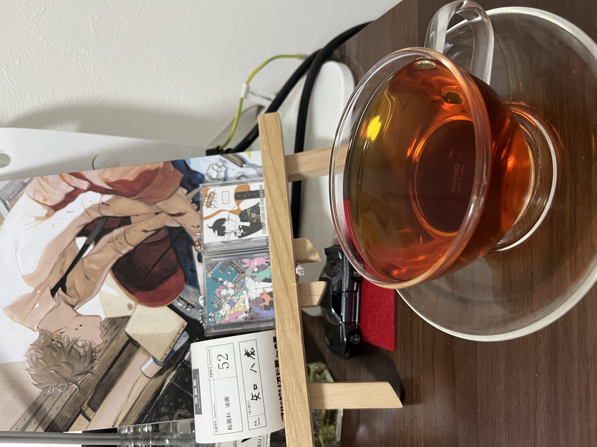
    
香ばしい良い香りでどこか黒糖のような甘さを感じてコクがあり，渋みが少なくてとても美味しいです． 
    ゆっくりとストレートで飲むのがおすすめです．

  

  

    
2024 CTC HINGALGODA茶園 PF1

    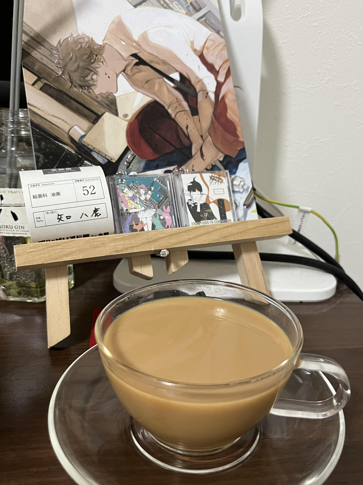
    
どこかナッツやアーモンドの様な香ばしい香りでどっしりと濃厚でコクのあるミルクティを楽しめます． 
    Hingalgoda茶園はスリランカ南部のヒニドゥマにありますが，コロンボ・ティー・オークションで20年以上トッププライスを記録し続けている評価の高い茶園です．

  

### NEPAL

ネパールはインドのダージリンと国境を接するヒマラヤ山脈麓に位置する紅茶の名産地でダージリンとほぼ同じ気候風土のためダージリンに似た香りと味わいのものが多いです．

#### 1st Flush

  

    
2025 JUN CHIYABARI茶園 Himalayan White 新緑

    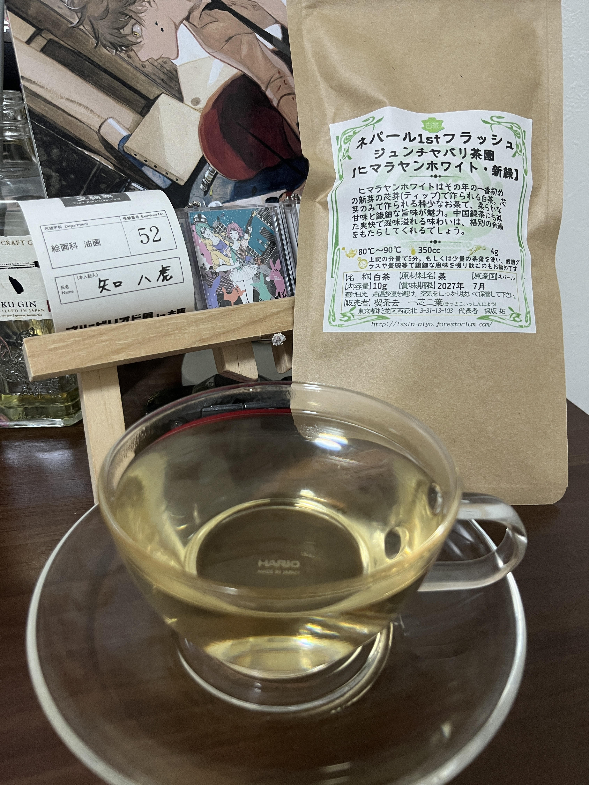
    
若々しいフレッシュな香りでまろやかな甘さの中にどこかキレのある味わいでとても美味しいです． 
    水色は薄いのですが，満足感が高く，ストレートでゆっくり飲むのが格別です． 
    また，低い温度で入れるとまろやかな甘みをより感じられ，高い温度で入れると香ばしさとキレをより感じられ，入れ方によって味わいが色々楽しめるのも面白いです．

  

  <!-- 

    
2024 DOOMNI農園 TGFOP1

    
    
ハーブの様な少し清涼感のある良い香りで深く厚みがあり，心地よい渋みを感じられてとても美味しかったです． 
    ストレートはもちろん，ミルクティも美味しかったです．
    深く厚みがあるので少し多めのお湯と茶葉で淹れて1杯目はストレートで楽しみ，2杯目や3杯目にミルクティや砂糖を入れて楽しむのが個人的に好きです．

  
 -->

#### 2nd Flush

### NILGIRI

ニルギリは南インドの西ガーツ山脈の広陵地帯に位置する紅茶の名産地です． 
現地のタミル語では青い山という意味であり，標高は1000m以上であり紅茶のブルーマウンテンとも称されます． 
雨が少なく，寒暖差が大きいことが特徴としてあり，冬がクオリティーシーズンです．

  

    
2025 Seasonal KAIRBETTA農園 SFTGFOP Winter Speciality

    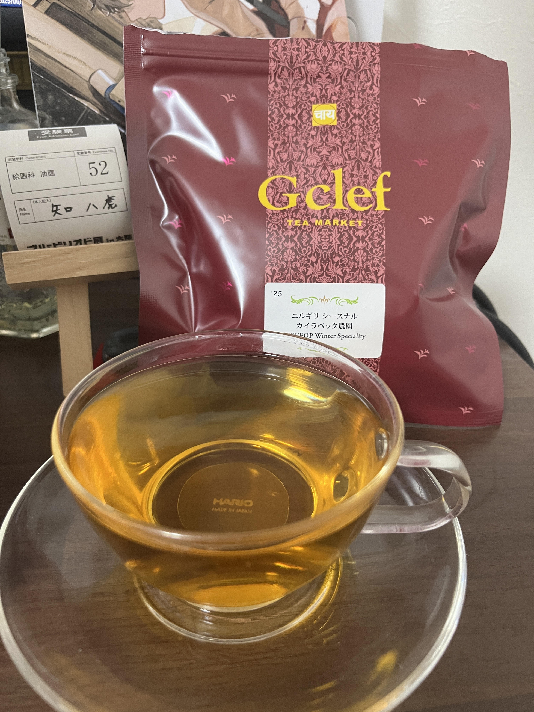
    
若々しい爽やかな良い香りで柑橘系も少し感じ，甘味もありますが，キリッとしたキレの良い味でとても美味しいです． 
    ホットはもちろん，アイスティも美味しいです．
    また，レモンティもとても美味しいです．

  

  <!-- 

    
2024 DOOMNI農園 TGFOP1

    
    
ハーブの様な少し清涼感のある良い香りで深く厚みがあり，心地よい渋みを感じられてとても美味しかったです． 
    ストレートはもちろん，ミルクティも美味しかったです．
    深く厚みがあるので少し多めのお湯と茶葉で淹れて1杯目はストレートで楽しみ，2杯目や3杯目にミルクティや砂糖を入れて楽しむのが個人的に好きです．

  
 -->

<!-- - 2025 Seasonal KAIRBETTA農園 SFTGFOP Winter Speciality

若々しい爽やかな良い香りで柑橘系も少し感じ，甘味もありますが，キリッとしたキレの良い味でとても美味しいです．
ホットはもちろん，アイスティも美味しいです．
また，レモンティもとても美味しいです．

 -->

---

**[ホームに戻る](/index)**